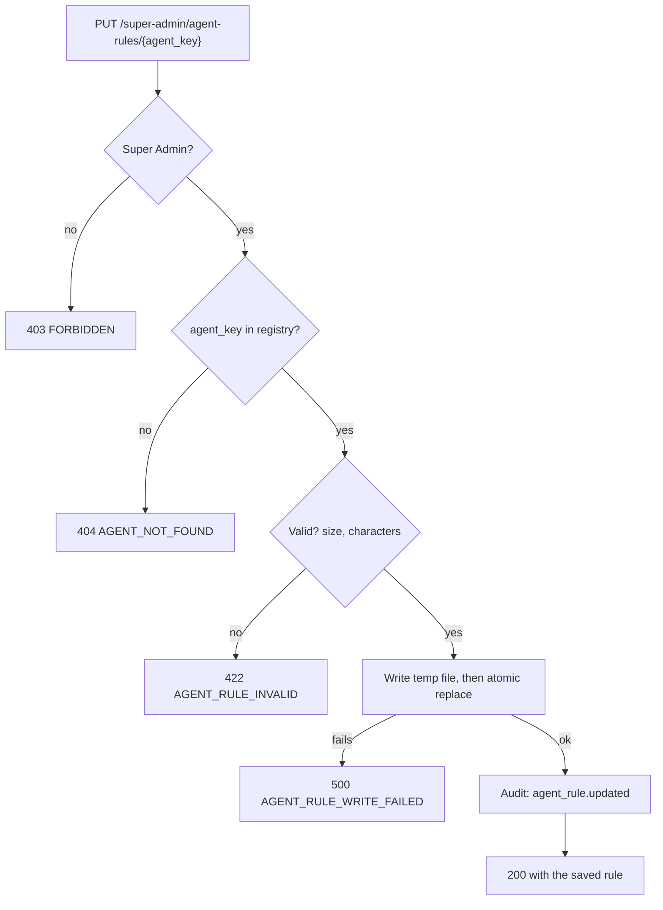
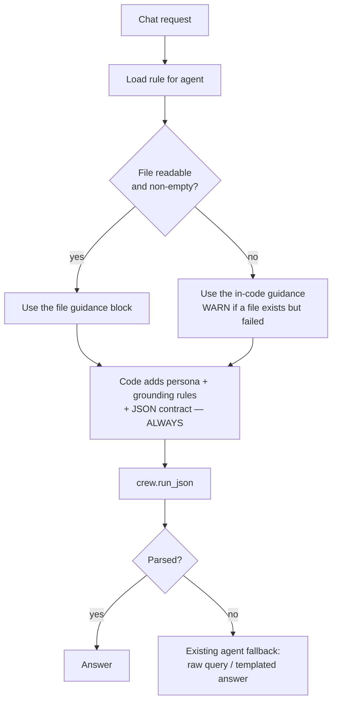

# Feature — Dynamic Agent Rules

> **Built.** Registry, reader, write path, API and Super Admin page all exist —
> `app/modules/ai/agent_rules.py` and `app/modules/ai/{schemas,services,controllers,routes}/`,
> with the screen at `/super-admin/agent-rules`. Covered by `tests/test_agent_rules.py` (25) and
> `tests/test_agent_rule_api.py` (26).
> Governed by [ADR-009](../architecture/decisions/ADR-009-dynamic-agent-rules.md).
>
> **Scope: the chat agents only** — Query Planner and Response Composer. Agent 1 is out of scope
> ([§13](#13-edge-cases), [ADR-009 Scope](../architecture/decisions/ADR-009-dynamic-agent-rules.md#scope)).

## 1. Requirement

A Super Admin can view and edit the instructions given to the chat agents, in plain text, from a
page in the application — without a code change or a deploy. Rules are stored in files at
application-controlled paths, never in the database.

Three operations: **view**, **add**, **edit**. There is no delete.

## 2. Business rules

- Rules are **global**. Not per-organization, and invisible to Organization Admins: one tenant
  editing the grounding rules would be editing them for every tenant.
- Only the **guidance block** is editable — one slot per agent. The persona, grounding rules and JSON output
  contract are appended by code and cannot be reached from this page. See
  [§11](#11-security-considerations) for why this is a security boundary rather than a
  convenience.
- **No delete.** Emptying a rule is how you return an agent to its in-code default, and that is
  what "add" and "edit" already allow. A delete verb would add a second way to reach the same
  state and one more thing to authorize.
- The Super Admin edits **content only**. Never a path, never a filename, never a location.
- **A rule that cannot be used is never an error to the user.** Every failure falls back to the
  in-code prompt and the chat proceeds.
- Every save is **audited**. A Super Admin can change how every tenant's chat behaves; that must
  not be possible silently.

## 3. User flow

```
/super-admin/agent-rules
   ↓
List of agents — name, role, whether a custom rule is in effect
   ↓
Select an agent
   ↓
View the current rule (and, read-only, the rules the code always appends)
   ↓
Edit the text · Save
   ↓
Applies to the NEXT chat message. No restart.
```

## 4. Backend flow





The second diagram's last step is the important one: **the rule file sits above the existing
fallbacks, not beside them.** A missing rule degrades to a working prompt. It does not push the
agent into its own fallback.

## 5. Frontend flow

`/super-admin/agent-rules` — a third entry in `SUPER_ADMIN_NAV` after Organizations and
Categories.

- A list of agents from the registry: display name, one-line role, and whether a custom rule is
  currently in effect or the built-in default is running.
- Selecting one opens an editor: a plain `<textarea>`, monospace, no formatting toolbar, no
  syntax mode. The requirement is plain text and the UI should not imply otherwise.
- Beneath the editor, **read-only**, the text the code always appends — the grounding rules and
  the JSON contract. A Super Admin needs to see what they are not allowed to change; hiding it
  invites them to paste a JSON schema of their own and wonder why nothing happens.
- **Reset to default** clears the file. It is not a delete: it restores the shipped prompt.
- No delete button, because there is no delete endpoint.

## 6. Database impact

**None.** No table, no column, no migration. That is the requirement, and it is what makes this
feature diffable and greppable at the cost of edit history.

The one database write is an `audit_logs` row per save, using the existing table.

## 7. API contract

| Method | Endpoint | Purpose |
| ------ | -------- | ------- |
| GET | `/super-admin/agent-rules` | List agents with their status |
| GET | `/super-admin/agent-rules/{agent_key}` | One agent's rule, plus the read-only appended text |
| PUT | `/super-admin/agent-rules/{agent_key}` | Save. Creates on first write, so "add" and "edit" are one call |
| DELETE | — | **Does not exist.** 405 |

```jsonc
// PUT /api/v1/super-admin/agent-rules/query_planner
{ "content": "You are the Query Planner agent.\n\nUnderstand the user's question and…" }
```

```jsonc
// GET /api/v1/super-admin/agent-rules/query_planner
{ "success": true,
  "data": {
    "agent_key": "query_planner",
    "name": "Query Planner",
    "role": "Rewrite a question into a standalone search query",
    "content": "…",              // "" when no custom rule is set
    "is_custom": false,          // false = the in-code default is running
    "default_content": "…",      // what runs when content is empty
    "locked_suffix": "…",        // appended by code, never editable
    "updated_at": "2026-08-31T10:22:04Z"
  } }
```

`agent_key` is a registry key, not a filename and not a path. The client never learns where the
file is, and could not use the information if it did.

## 8. Celery impact

**None in this scope.** Both chat agents run in the API process.

This is the constraint to check before extending to agent 1: the worker imports the same
modules, so a rule saved through the API would not be seen by a long-lived worker that had
already cached it. Caching must therefore key on file mtime, never on process lifetime, so the
extension does not require a restart-on-save workaround.

## 9. Qdrant impact

**None.** Rules change how questions are phrased and how answers are written. They do not touch
vectors, payloads or collections.

Indirectly: a badly edited Query Planner rule produces worse search queries, and retrieval gets
worse without anything failing. See [§13](#13-edge-cases).

## 10. Redis impact

**None.** Not cached in Redis — a local file read does not need a network round trip in front of
it, and a distributed cache would add an invalidation problem the filesystem does not have.

## 11. Security considerations

- **Super Admin only.** `require_super_admin` on every route; an Organization Admin token is 403
  before any handler runs, matching the existing super-admin suites.
- **No path input, ever.** A hard-coded `agent_key → Path` registry. Path traversal is
  unrepresentable rather than filtered: there is no user-supplied path component to traverse
  with. An unknown key is 404, not a filesystem lookup.
- **Editable envelope.** Grounding rules and the JSON contract are appended after the file
  content on every call and cannot be reached from this page. Without this, deleting the
  contract silently degrades every chat to a templated answer, and softening the grounding rules
  produces confident invented answers that pass every check the system has — the citation
  verifier drops invented *ids*, but not an invented *claim* attached to a real one.
- **Atomic writes.** Temp file, then replace. A truncated prompt is still a *valid* prompt: it
  would be used, not rejected.
- **Input validation.** Size cap — a runaway rule crowds the retrieved passages out of the
  context window, which looks like bad retrieval rather than a bad prompt. Reject control
  characters. Accept anything else: it is prose.
- **Prompt injection** is in scope but not a validation problem here. The author is the most
  trusted role in the system; the bound is the envelope, not a filter.
- **Audited.** `agent_rule.updated`, with the agent key and the actor. Compare
  `organization_admin.contact_changed`: a Super Admin power that authorization cannot restrict,
  so the guarantee becomes *cannot be exercised silently*.
- **Never logged.** Rule content may be quoted into prompts alongside document text. It follows
  the existing rule in `crew.py`: prompts are not logged (§39).

## 12. Error handling

| Situation | Code | HTTP |
| --------- | ---- | ---- |
| Unknown agent key | `AGENT_NOT_FOUND` | 404 |
| Too large, or control characters | `AGENT_RULE_INVALID` | 422 |
| Cannot write the file | `AGENT_RULE_WRITE_FAILED` | 500 |
| Organization Admin token | `FORBIDDEN` | 403 |
| No token | `UNAUTHORIZED` | 401 |
| DELETE attempted | — | 405 |

A **read** failure at chat time has no error code, because it is not an error the caller sees:
it is a WARNING in the log and the in-code prompt.

## 13. Edge cases

| Case | Behaviour |
| ---- | --------- |
| File does not exist | In-code prompt. The normal state before a first edit |
| File is empty or whitespace | In-code prompt. This is what "reset to default" produces |
| File unreadable — permissions | In-code prompt, WARNING |
| File deleted between two requests | Next request uses the in-code prompt |
| Rule is prose that makes no sense | Agent still returns JSON; answer quality drops. **Nothing fails** |
| Rule breaks the planner's output | `plan()` returns `degraded=True` and retrieval uses the raw question — the existing fallback, invisibly |
| Rule breaks the composer's output | Templated answer over the same chunks — the existing fallback |
| Two Super Admins editing | Last write wins. No locking; the audit trail shows both |
| Rule saved mid-request | The in-flight request finishes on the old rule; the next one uses the new |

The two "breaks the output" rows are the reason [§14](#14-testing-requirements) tests that an
edit is *actually used*. Both failures are invisible: the chat keeps working, slightly worse,
with a 200 and no error anywhere. A rule that silently stopped applying and a rule that was
never edited look identical from the outside.

## 14. Testing requirements

```
test_view_returns_the_default_when_no_rule_is_set
test_saving_creates_the_file_on_first_write        ← "add" and "edit" are one call
test_editing_replaces_the_previous_content
test_an_edited_rule_is_actually_used_by_the_agent  ← the one that matters
test_empty_content_restores_the_built_in_prompt
test_missing_file_falls_back_silently
test_unreadable_file_falls_back_and_warns
test_write_failure_returns_500_and_leaves_the_old_rule_intact
test_oversized_rule_is_rejected
test_unknown_agent_key_is_404_not_a_file_lookup
test_org_admin_cannot_read_or_write_rules
test_unauthenticated_request_is_401
test_delete_is_not_routed                          ← 405, no handler exists
test_grounding_rules_survive_a_hostile_edit        ← the security boundary
test_json_contract_survives_a_hostile_edit
test_query_planner_fallback_still_works
test_response_composer_fallback_still_works
test_existing_chat_suites_still_pass               ← regression
```

## 15. Acceptance criteria

- [ ] Super Admin can view, add and edit a rule for each chat agent
- [ ] Rules are stored in files under `backend/config/agent_rules/`, never in the database
- [ ] The Super Admin never supplies or sees a file path
- [ ] There is no delete operation, and no delete route
- [ ] An edited rule applies to the next message without a restart
- [ ] Grounding rules and the JSON contract cannot be edited away
- [ ] Every documented failure falls back to the in-code prompt, and no chat fails
- [ ] Organization Admins are 403 on every route
- [ ] Every save writes an `agent_rule.updated` audit row
- [ ] The existing chat suites pass unchanged
