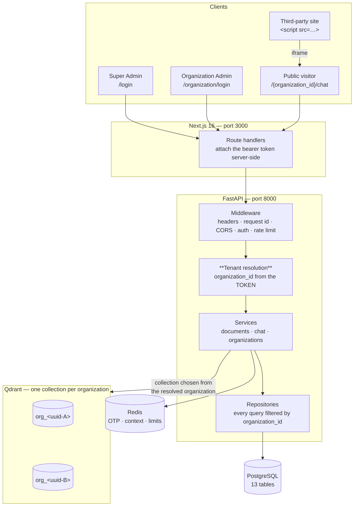
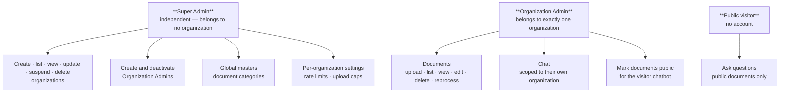
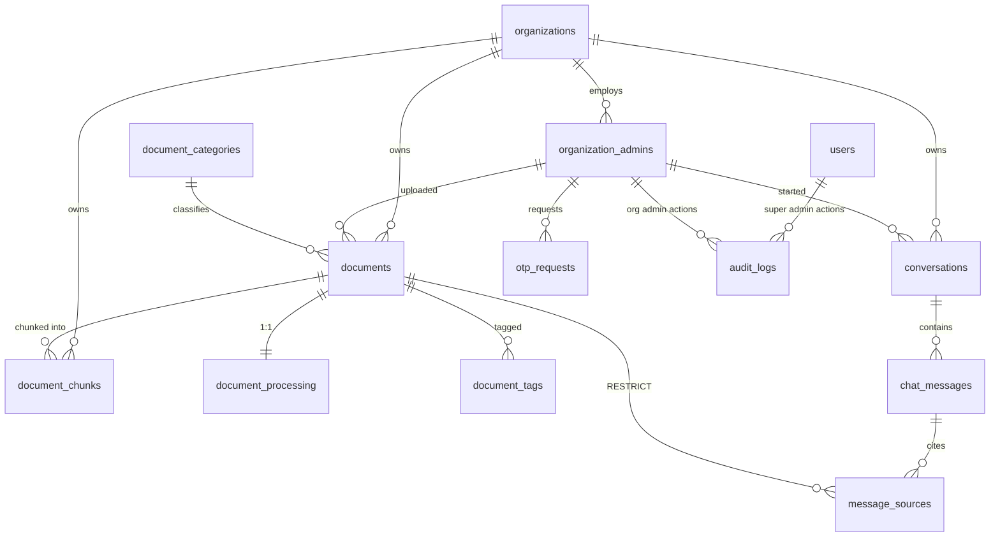
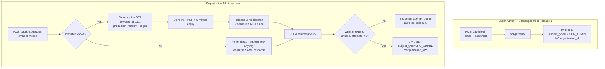
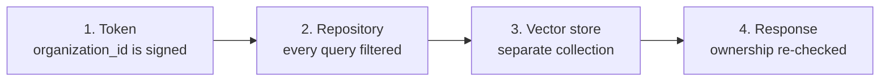
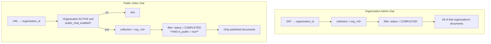
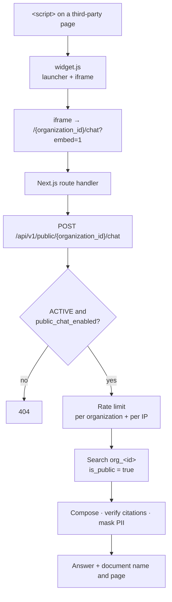

# EnterpriseRAG — Release 2

Multi-tenancy, Super Admin organization management, OTP authentication, and a public
organization chatbot.

**Status:** design approved, not implemented. Release 1 is unchanged and remains the running
system. Nothing in this document has been built.

**Scope:** localhost only. Production deployment is explicitly out of scope and deferred
([§13](#13-what-release-2-is-not)).

---

## Feature documentation

Per-feature specifications, each in the same 15-section format as the Release 1 feature docs:
**[features/](features/README.md)**

| | | |
| --- | --- | --- |
| [Tenant isolation](features/tenant-isolation.md) | [OTP authentication](features/otp-authentication.md) | [Organization management](features/organization-management.md) |
| [Organization admins](features/organization-admin-management.md) | [Scoped documents](features/organization-scoped-documents.md) | [Scoped chat](features/organization-scoped-chat.md) |
| [Public chatbot](features/public-chatbot.md) | [Organization settings](features/organization-settings.md) | [Category management](features/category-management.md) |

This document holds the cross-feature design and rationale.

---

## Contents

- [1. Overview](#1-overview)
- [2. Release 1 vs Release 2](#2-release-1-vs-release-2)
- [3. Architecture](#3-architecture)
- [4. Roles and permissions](#4-roles-and-permissions)
- [5. Database design](#5-database-design)
- [6. Authentication and authorization](#6-authentication-and-authorization)
- [7. Tenant isolation](#7-tenant-isolation)
- [8. Vector database design](#8-vector-database-design)
- [9. API design](#9-api-design)
- [10. Frontend changes](#10-frontend-changes)
- [11. Public chatbot](#11-public-chatbot)
- [12. Security](#12-security)
- [13. What Release 2 is not](#13-what-release-2-is-not)
- [14. Testing](#14-testing)
- [15. Development breakdown](#15-development-breakdown)
- [16. Risks and dependencies](#16-risks-and-dependencies)
- [17. Open items](#17-open-items)

---

## 1. Overview

Release 1 is a single-administrator system. One person owns the corpus, uploads to it, and
queries it. There is no notion of an organization anywhere in the codebase — `grep -rn
"organization" backend/app/` returns nothing.

Release 2 turns that into a multi-tenant platform:

1. **Super Admin** — one operator, outside every organization, who creates organizations and
   their administrators, manages the global category master, and sets per-organization limits.
2. **Organization Admin** — logs in with an OTP, uploads and manages that organization's
   documents, and chats against them.
3. **Public visitor** — no login at all, chats against the documents an organization has
   explicitly published, either on a hosted page or through an embedded widget on a third-party
   site.

The defining constraint is stated once and enforced everywhere:

> An Organization Admin must never retrieve a document, chunk, vector, chat message or citation
> belonging to another organization. This is enforced in the data-access layer, not in the UI.

---

## 2. Release 1 vs Release 2

Verified against the code, not assumed.

| Area | Release 1 (built) | Release 2 (proposed) |
| ---- | ----------------- | -------------------- |
| Identities | One `users` row; **no `role` column** (ADR-001) | `users` = Super Admins (unchanged) + new `organization_admins` table |
| Authentication | Password → JWT + refresh cookie | Super Admin: unchanged. Org Admin: **OTP only, no password** |
| Organizations | None — zero references in the codebase | `organizations` table; every tenant-owned row carries `organization_id` |
| Authorization | Every authenticated request is fully privileged | Two subject types, distinct route sets, no overlap |
| Documents | Global list; `created_by` recorded but **never filtered on** | Scoped to the caller's organization at the repository layer |
| Vector store | One collection, `documents` | **One collection per organization**, `org_<uuid>` |
| Retrieval filter | `status = COMPLETED` + optional category/type/language/tags | Same, inside the organization's own collection |
| Chat | Conversations scoped by `user_id` (already) | Scoped by organization; visitors get anonymous sessions |
| Public access | None | `/{organization_id}/chat` + embeddable widget, public documents only |
| Limits | Global `.env` values | Per-organization rows, global value as the default |
| Categories | 10 seeded, system-wide, no admin UI | Still global; Super Admin can add and edit them |

**Already in place and reused unchanged:** JWT issue/verify, the Redis refresh denylist,
bcrypt hashing, the middleware chain, the audit log, the 14-stage processing pipeline, OCR,
chunking, local embeddings, the two CrewAI agents, PII masking, and the rate-limit engine.

---

## 3. Architecture

Release 2 adds a tenant dimension. It does not change the shape of the system.



**The single most important arrow** is `RESOLVE`. The organization is derived from the
authenticated subject once, at the edge, and passed down. No service and no repository accepts an
organization id from the request body or query string.

---

## 4. Roles and permissions

Two roles. There is no third.



### Permission matrix

| Capability | Super Admin | Org Admin | Public visitor |
| ---------- | :---------: | :-------: | :------------: |
| Create / update / suspend / delete organizations | ✅ | ❌ | ❌ |
| Create / deactivate Organization Admins | ✅ | ❌ | ❌ |
| Manage the global category master | ✅ | ❌ | ❌ |
| Set an organization's rate limits and upload cap | ✅ | ❌ | ❌ |
| Upload / edit / delete documents | ❌ | ✅ own org | ❌ |
| **Read document content or chat history** | ❌ | ✅ own org | public only |
| Chat against the full organization corpus | ❌ | ✅ own org | ❌ |
| Chat against public documents | ❌ | ✅ | ✅ |

### The Super Admin privacy guarantee, and its one weak point

The Super Admin genuinely cannot read organization data: they have no Organization Admin
credential, no password to reset (Org Admins have no password), and every document and chat route
resolves the organization from the *caller's own* token — a Super Admin token carries no
organization, so those routes reject it outright.

The residual hole is that the Super Admin **sets an Organization Admin's email and mobile**, and
could point one at an address they control to receive the OTP.

**Mitigation, mandatory:** changing an existing Organization Admin's email or mobile writes an
audit row of its own (`organization_admin.contact_changed`) recording the old and new values and
the acting Super Admin. The guarantee is therefore *"cannot read silently"*, not *"cannot read"* —
and the documentation says so rather than overstating it.

---

## 5. Database design

### New tables

**`organizations`**

| Column | Type | Notes |
| ------ | ---- | ----- |
| `id` | UUID PK | Appears in the public chat URL — treated as public knowledge |
| `name` | String(255) | Display name |
| `slug` | String(120) unique | Internal reference and the Qdrant collection suffix |
| `status` | Enum | `ACTIVE` · `SUSPENDED` · `DELETED` |
| `contact_email` | String(255) | Billing / operational contact |
| `max_documents` | Integer | Upload cap; Super Admin configurable |
| `max_document_size_mb` | Integer | Falls back to the global default |
| `rate_limit_chat` | String(32) | e.g. `30/minute` — parsed by the existing limiter |
| `rate_limit_upload` | String(32) | |
| `rate_limit_public_chat` | String(32) | Applies to the anonymous widget |
| `public_chat_enabled` | Boolean | Master switch for the visitor chatbot |
| `public_chat_key` | String(64) unique | Opaque key used by the embed snippet |
| `created_at` / `updated_at` / `deleted_at` | Timestamps | Soft delete |

**`organization_admins`** — separate from `users` by decision; **no password column**.

| Column | Type | Notes |
| ------ | ---- | ----- |
| `id` | UUID PK | |
| `organization_id` | UUID FK → `organizations.id` | `ON DELETE RESTRICT` — see below |
| `full_name` | String(255) | |
| `email` | String(255) **unique** | OTP identifier |
| `mobile` | String(20) **unique**, nullable | OTP identifier |
| `is_active` | Boolean | Deactivation without deletion |
| `last_login_at` | Timestamp, nullable | |
| `created_at` / `updated_at` | Timestamps | |

> `email` and `mobile` are **globally** unique, not unique per organization. An OTP identifier
> must resolve to exactly one admin, or login is ambiguous.

**`otp_requests`**

| Column | Type | Notes |
| ------ | ---- | ----- |
| `id` | UUID PK | |
| `identifier` | String(255) index | The email or mobile as entered |
| `identifier_type` | Enum | `EMAIL` · `MOBILE` |
| `organization_admin_id` | UUID FK, nullable | Null when the identifier matched nothing — the row is still written, so a probe looks identical to a real request |
| `otp_hash` | String(255) | **Hashed, never plaintext** |
| `expires_at` | Timestamp | Now + 5 minutes |
| `is_verified` | Boolean | |
| `attempt_count` | Integer | Burned at 5 |
| `created_at` | Timestamp | |
| `ip_address` | INET, nullable | Reuses the existing `coerce_ip` helper |

**`organization_settings_audit`** — optional but recommended: who changed which limit, when,
from what to what. Without it, "the Super Admin cannot read your data" has no counter-evidence
trail.

### Modified tables

| Table | Change |
| ----- | ------ |
| `documents` | **+`organization_id`** FK NOT NULL, indexed; **+`is_public`** Boolean default false; `created_by` retargets `users.id` → `organization_admins.id` |
| `document_chunks` | **+`organization_id`** — denormalised deliberately, so a chunk query cannot forget to join |
| `document_tags` | Unchanged (reached only through `documents`) |
| `document_processing` | Unchanged (1:1 with `documents`) |
| `conversations` | **+`organization_id`** NOT NULL; `user_id` → **nullable** `organization_admin_id`; **+`visitor_session_id`** nullable; CHECK: exactly one of the two is set |
| `chat_messages` | Unchanged (reached only through `conversations`) |
| `message_sources` | Unchanged |
| `audit_logs` | `user_id` → **`super_admin_id`** and **`organization_admin_id`**, both nullable, plus **`actor_type`**; **+`organization_id`** nullable |
| `document_categories` | Unchanged — global by decision |
| `users` | **Unchanged** — Super Admins only |

### Why `document_chunks` carries a redundant `organization_id`

It is derivable by joining `documents`. It is stored anyway because the failure mode of forgetting
the join is silent cross-tenant data return, and the cost of the column is a UUID per row. A
denormalised column that makes the wrong query impossible is worth more than the normal form.

### ER diagram



### Indexes

| Index | Serves |
| ----- | ------ |
| `(organization_id, status, deleted_at)` on `documents` | The document list — the hottest query, now tenant-first |
| `(organization_id, is_public)` on `documents` | The public chatbot's corpus |
| `(organization_id)` on `document_chunks` | Chunk lookups and cascade deletes |
| `(organization_id, last_message_at)` on `conversations` | The chat sidebar |
| `(identifier, created_at)` on `otp_requests` | OTP lookup and rate limiting |
| `(organization_id, created_at)` on `audit_logs` | Per-organization audit review |

Every existing composite index that starts with something else gains `organization_id` as its
**leading** column. A tenant filter that is not the leading column still scans other tenants' rows.

### Migration

Existing document data is deleted (approved), which removes the hardest part — there is no
backfill of `organization_id` on live rows and no Qdrant re-stamping.

1. Create `organizations`, `organization_admins`, `otp_requests`.
2. Truncate `message_sources`, `chat_messages`, `conversations`, `document_chunks`,
   `document_tags`, `document_processing`, `documents` — in that order (`message_sources` holds
   `ON DELETE RESTRICT` on `documents`).
3. Add the new columns as NOT NULL — safe, because the tables are empty.
4. Retarget the three foreign keys.
5. Drop the `documents` Qdrant collection; per-organization collections are created on demand.
6. Seed one organization and one Organization Admin so the system is usable.

The existing `users` row (the Release 1 admin) becomes the Super Admin. No user-facing change for
that account.

---

## 6. Authentication and authorization

### Two subjects, two flows



### The token is the tenant

```json
{
  "sub": "<subject id>",
  "subject_type": "SUPER_ADMIN | ORG_ADMIN",
  "organization_id": "<uuid, ORG_ADMIN only>",
  "exp": 1234567890
}
```

`organization_id` lives in the signed token and nowhere else. It is never read from a path, a
query parameter or a body on an authenticated route.

### OTP security controls

| Control | Value | Why |
| ------- | ----- | --- |
| Expiry | 5 minutes | Bounded window |
| Max attempts | 5, then the code is burned | **A 4-digit code is 10,000 combinations. Without this it is not authentication** |
| Single use | Invalidated on success | No replay |
| Storage | Hashed | A database read must not yield a working code |
| Request rate limit | Per identifier **and** per IP | Prevents flooding one inbox and mass enumeration |
| Unknown identifier | Identical response and timing | No account enumeration |
| Comparison | Constant time | No timing oracle |

### The static OTP guard

`1111` applies to `ENVIRONMENT` in {`development`, `staging`} — "UAT" maps onto the existing
`staging` value, so no new environment is introduced.

**The application must refuse to start** if a static OTP is enabled while `ENVIRONMENT=production`.
A silent misconfiguration here means anyone who knows an email address can log in as that
administrator. It fails loudly at boot or not at all.

---

## 7. Tenant isolation

Isolation is enforced at four layers. Any one of them failing must not be sufficient to leak.



**Layer 1 — the token.** Established at login, never accepted from the request.

**Layer 2 — the repository.** Every method that reads a tenant-owned table takes
`organization_id` as a **required, non-defaulted** parameter.

```python
# Wrong. An optional tenant filter fails open: one forgotten call site leaks silently.
def list_documents(self, query: ListQuery, organization_id: UUID | None = None): ...

# Right. Omitting it is a TypeError at import time, not a data leak in production.
def list_documents(self, organization_id: UUID, query: ListQuery): ...
```

**Layer 3 — the vector store.** A separate collection per organization, so retrieving another
tenant's vectors requires *naming their collection*, not *forgetting a filter*.

**Layer 4 — the response.** Fetch-by-id re-checks ownership and returns **404, not 403**. A 403
confirms the id exists.

---

## 8. Vector database design

### Collection per organization

```
org_550e8400e29b41d4a716446655440000
org_6ba7b8109dad11d180b400c04fd430c8
```

Naming: `org_` + the organization UUID with hyphens removed. Deterministic, no lookup table.

**Why this over a payload filter.** Both isolate correctly when the code is correct. They differ
when it is not:

| | Payload filter | Collection per org |
| --- | -------------- | ------------------ |
| Forgotten filter | Returns **every tenant's** chunks | Returns nothing — the collection is chosen, not filtered |
| Wrong tenant id | Returns that tenant's data | Collection does not exist → error |
| Deleting an organization | Filtered delete across a shared index | Drop the collection |
| Cost | One collection | One per organization; a few hundred is unremarkable for Qdrant |

The failure mode of the first is a silent cross-tenant leak. The failure mode of the second is an
empty result or a loud error. For a requirement stated as mandatory, that difference is the whole
argument.

### Changes to the existing vector layer

| Function | Today | Release 2 |
| -------- | ----- | --------- |
| `ensure_collection()` | Reads `settings.QDRANT_COLLECTION` | `ensure_collection(organization_id)` |
| `upsert_chunks()` | Fixed collection | Collection resolved from the document's organization |
| `delete_document_vectors()` | Fixed collection | Same |
| `search()` | Fixed collection, optional filters | **`organization_id` required, first positional** |
| `point_id_for()` | `uuid5(ns, "doc:index")` | Unchanged — already unique per document |

`ChunkPayload` gains `organization_id` and `is_public`. The organization field is redundant given
the collection split — it is carried anyway as a cross-check, so an audit can prove a stray point
did not come from elsewhere. `is_public` is **not** redundant: it is the filter that separates the
public chatbot's corpus from the organization's own.

### Retrieval flows



The public path is the only place an organization id comes from a URL, and it is the only path
carrying the extra `is_public` condition. Those two facts belong together: the untrusted input and
the narrowed corpus.

---

## 9. API design

### Super Admin — `/api/v1/super-admin/*`

Requires `subject_type = SUPER_ADMIN`. An Organization Admin token is rejected with 403.

| Method | Endpoint | Purpose |
| ------ | -------- | ------- |
| POST | `/organizations` | Create an organization |
| GET | `/organizations` | List, with search and pagination |
| GET | `/organizations/{id}` | Detail — **metadata and counts only, never content** |
| PATCH | `/organizations/{id}` | Update name, contact, limits, public-chat switch |
| POST | `/organizations/{id}/suspend` | Reversible: blocks login and public chat, retains data |
| DELETE | `/organizations/{id}` | Soft delete; drops the Qdrant collection |
| POST | `/organizations/{id}/admins` | Create an Organization Admin |
| GET | `/organizations/{id}/admins` | List that organization's admins |
| PATCH | `/admins/{id}` | Update contact — **writes a contact-changed audit row** |
| DELETE | `/admins/{id}` | Deactivate |
| GET/POST/PATCH | `/categories` | The global category master |

> `GET /organizations/{id}` returns document **counts**, not titles, filenames or content. A
> Super Admin browsing an organization's document names would already be reading its data.

### Organization Admin — the existing routes, now scoped

| Method | Endpoint | Change |
| ------ | -------- | ------ |
| POST | `/auth/otp/request` | **New** |
| POST | `/auth/otp/verify` | **New** — returns the token pair |
| POST | `/admin/documents/upload` | Organization from the token; enforces `max_documents` |
| GET | `/admin/documents` | Filtered by organization |
| GET/PATCH/DELETE | `/admin/documents/{id}` | Ownership checked; 404 on another tenant's id |
| PATCH | `/admin/documents/{id}/publish` | **New** — toggles `is_public` |
| POST | `/chat/conversations` | Organization stamped from the token |
| POST | `/chat/conversations/{id}/messages` | Retrieval confined to the organization's collection |

Paths are unchanged, which keeps the frontend contract stable. Only their scope changes.

### Public — `/api/v1/public/*`

No authentication. Rate limited per organization and per IP.

| Method | Endpoint | Purpose |
| ------ | -------- | ------- |
| GET | `/public/{organization_id}/config` | Display name, theme, greeting; 404 if disabled |
| POST | `/public/{organization_id}/chat` | Ask a question against public documents |

```jsonc
// POST /api/v1/public/{organization_id}/chat
{ "message": "What are your opening hours?", "session_id": "<uuid, client-generated>" }

// 200 — a refusal is also a 200
{ "success": true,
  "data": { "answer": "…", "is_grounded": true,
            "sources": [{ "document_name": "Hours.pdf", "page": 1 }],
            "session_id": "…" } }
```

Public sources expose `document_name` and `page` — never `document_id` or `chunk_id`. Internal
identifiers are not useful to a visitor and give an attacker a map.

---

## 10. Frontend changes

| Route | Who | Auth |
| ----- | --- | ---- |
| `/login` | Super Admin | Password |
| `/super-admin/organizations` | Super Admin | Organization CRUD |
| `/super-admin/organizations/{id}/settings` | Super Admin | Limits, public-chat switch |
| `/super-admin/categories` | Super Admin | Global master |
| `/organization/login` | Org Admin | Two-step OTP |
| `/dashboard`, `/documents`, `/upload`, `/chat` | Org Admin | Existing screens, tenant-scoped |
| `/{organization_id}/chat` | Public | Standalone chat page, no shell |

**Reusable unchanged:** `Button`, `Card`, `StatusBadge`, `Markdown`, `DocumentTable`,
`FilterBar`, `DocumentDrawer`, `UploadPanel`, `ChatPanel`.

**New:** the OTP two-step form, organization CRUD screens, category management, and a
minimal-chrome public chat page.

**BFF change.** `src/lib/session.ts` gains the subject type so route handlers can route to the
correct login and reject a Super Admin token on organization routes before it reaches the backend.
This is a convenience, not a control — the backend re-checks regardless.

---

## 11. Public chatbot

### Embedding

```html
<script src="http://localhost:3000/widget.js"
        data-organization-id="550e8400-e29b-41d4-a716-446655440000"
        defer></script>
```

`widget.js` injects a launcher button and an iframe pointing at
`/{organization_id}/chat?embed=1`.



### Why an iframe

The widget renders inside an iframe rather than injecting DOM into the host page. The host page
cannot read the conversation, our CSS cannot break their layout, and their CSS cannot break ours.
For a chat that may surface an organization's published policies onto an arbitrary third-party
site, that isolation is the point.

### Reusing the Stitch reference

`stitch_documind_ai_interface/ai_rag_chat/code.html` was reviewed. It is a **static export**: 411
lines, Tailwind via CDN, three inert `<script>` tags, no state and no backend calls.

**Assessment: reuse the visual design, not the file.** The layout, chip styling and message
bubbles are worth keeping; the markup itself has no data flow to adapt, and the CDN Tailwind
dependency is unsuitable for anything embedded. The existing React `ChatPanel` already implements
the behaviour and renders Markdown — the public page should be a trimmed version of that
component, not a port of the HTML.

`tidio-live-chat.png` in the same folder is a reference screenshot for the launcher pattern.

### Abuse controls

| Vector | Control |
| ------ | ------- |
| Unlimited questions | Per-organization rate limit, Super Admin configurable |
| One abusive visitor | Per-IP limit, in addition |
| Cost amplification | Message length cap; the organization limit bounds worst-case spend |
| Prompt injection | Existing composer rules; the corpus is admin-published |
| Data probing | Only `is_public` documents are reachable; refusal is the default |
| Scraping the corpus | Answers are grounded and cited; the source document is never downloadable |

---

## 12. Security

### Cross-organization access — the test that matters

| Attempt | Expected |
| ------- | -------- |
| Org A admin requests Org B's document id | **404**, not 403 |
| Org A admin sends `organization_id=B` in a body or query | Ignored; the token wins |
| Org A admin chats | Retrieval touches `org_A` only |
| Org A admin lists documents | Org B rows absent from the query, not filtered afterwards |
| Public chat at Org B's URL | Only Org B's **public** documents |
| Public chat asks about a private document | Grounded refusal |
| Super Admin token on `/admin/documents` | **403** — no `organization_id` in the token |
| Suspended organization: admin login | Rejected |
| Suspended organization: public chat | 404 |

### Inherited from Release 1 and still in force

Rate limiting, security headers, PII masking of validated PAN and Aadhaar values, the append-only
audit log, `sort` whitelisting, parameterised SQL, escaped Markdown rendering with restricted link
protocols, and the exact-match public-path set in the auth middleware.

### New surface introduced by Release 2

| Surface | Control |
| ------- | ------- |
| Unauthenticated public chat | Organization must be ACTIVE **and** opted in; public documents only; rate limited |
| CORS for the widget | The public endpoints are the only ones that may accept a third-party origin |
| OTP endpoints | Attempt cap, expiry, hashing, no enumeration |
| Organization id in a URL | Public knowledge by design; **never** trusted on an authenticated route |
| Two token subject types | Route sets are disjoint; each rejects the other's token |

---

## 13. What Release 2 is not

Stated plainly, because the alternative is a document that implies guarantees the build does not
have.

1. **Organization Admin login is not an authentication boundary in Release 2.** The OTP is `1111`
   on localhost and there is no dispatch until Release 3. Anyone who knows an admin's email can
   log in. This is acceptable *only* because the deployment is localhost-only, and it is the
   single most important sentence in this document.
2. **This is not a production deployment design.** Release 1's security model assumes everything
   binds to `127.0.0.1`; Qdrant, Redis and Flower are unauthenticated by design. A genuinely
   public chatbot inverts that assumption. Production requires a separate hardening pass —
   HTTPS, authenticated infrastructure, a real secret store, and an origin allow-list for the
   widget.
3. **There is no email or SMS capability anywhere in the codebase.** Release 3 adds it.
4. **No per-organization data export, billing, usage metering or SSO.**

---

## 14. Testing

### Isolation — the suite that must exist

Two organizations, each with documents, and every cross-tenant path asserted:

```
test_org_a_admin_cannot_read_org_b_document          → 404
test_org_id_in_body_is_ignored_token_wins            → Org A data only
test_chat_retrieval_never_leaves_the_org_collection  → org_A only
test_document_list_excludes_other_orgs               → filtered in SQL, not after
test_public_chat_returns_only_public_documents       → private never cited
test_public_chat_on_suspended_org                    → 404
test_super_admin_token_rejected_on_document_routes   → 403
test_deleting_an_org_drops_its_collection            → collection gone
```

### OTP

```
test_expired_otp_rejected · test_otp_burns_after_five_attempts
test_otp_is_single_use · test_unknown_identifier_response_is_identical
test_static_otp_refused_when_environment_is_production   ← the guard
test_otp_is_stored_hashed_never_plaintext
```

### Regression

Release 1's suite is **354 tests across 13 suites**. Every one that touches documents, chat or
auth needs an organization fixture. The expected outcome is that they pass unchanged in behaviour
once scoped — if a Release 1 test starts failing for a reason other than a missing fixture, the
tenant change has altered semantics somewhere it should not have.

`tests/conftest.py::reset_database` gains the three new tables in dependency order.

---

## 15. Development breakdown

Ordered by dependency. Complexity is relative, not an estimate in hours — the Release 1 codebase
is the baseline, and the vector work is smaller than it looks because there is exactly **one**
call site into Qdrant search.

| # | Module | Work | Depends on | Complexity | Priority |
| - | ------ | ---- | ---------- | ---------: | -------- |
| 1 | **Schema** | 3 new tables, 6 modified, 3 FKs retargeted, one migration | — | High | P0 |
| 2 | **Auth model** | `subject_type` in the JWT, two-subject `current_user`, route guards | 1 | Medium | P0 |
| 3 | **OTP** | Request/verify, hashing, expiry, attempt cap, environment guard | 1, 2 | Medium | P0 |
| 4 | **Tenant plumbing** | `organization_id` required on every repository method | 1, 2 | **High** | P0 |
| 5 | **Vector split** | Per-organization collections; `search()` signature change | 4 | Medium | P0 |
| 6 | **Org CRUD** | Super Admin services, controllers, routes | 1, 2 | Medium | P1 |
| 7 | **Org settings** | Per-org limits feeding the existing limiter | 6 | Low | P1 |
| 8 | **Categories** | Master CRUD — the model already exists | 2 | Low | P2 |
| 9 | **Public chat API** | Unauthenticated endpoint, `is_public` filter, rate limits | 5 | Medium | P1 |
| 10 | **Widget** | `widget.js`, iframe page, embed mode | 9 | Medium | P2 |
| 11 | **Frontend — Super Admin** | Organization and category screens | 6, 8 | Medium | P1 |
| 12 | **Frontend — OTP** | Two-step login | 3 | Low | P0 |
| 13 | **Frontend — scoping** | Existing screens against scoped APIs | 4 | Low | P1 |
| 14 | **Isolation tests** | The cross-tenant suite | 4, 5, 9 | **High** | **P0** |
| 15 | **Regression** | Release 1 suite with organization fixtures | 4 | Medium | P0 |

**Items 4, 5 and 14 are the release.** Everything else is CRUD over a schema. If effort has to be
cut, cut screens — never the isolation tests, which are the only evidence the central requirement
actually holds.

---

## 16. Risks and dependencies

| Risk | Impact | Mitigation |
| ---- | ------ | ---------- |
| A repository method missing its tenant filter | **Cross-tenant leak** | Required non-defaulted parameter; the isolation suite; review every `select(` in a repository |
| Static OTP reaching a non-localhost environment | Complete auth bypass | Startup guard that refuses to boot |
| Super Admin repointing an admin's email | Silent access to an organization | Contact changes write a dedicated audit row |
| Qdrant collection sprawl | Operational noise | Deterministic names; dropped with the organization |
| Regression in Release 1 behaviour | Working features break | Full suite re-run with fixtures; no behavioural change expected |
| Public endpoint abuse | Cost and availability | Two-dimensional rate limiting, configurable per organization |

**New dependencies:** none. No new library is required — OTP is `secrets` plus the existing
hashing, and the rate limiter, JWT layer and audit log already exist.

---

## 17. Open items

Marked rather than invented, per the working rules.

| # | Item | Status |
| - | ---- | ------ |
| 1 | SMS and email provider for Release 3 dispatch | `UNKNOWN / REQUIRES CONFIRMATION` |
| 2 | Whether a suspended organization's public chat should 404 or show a "temporarily unavailable" page | Assumed **404**; low cost to change |
| 3 | Retention for anonymous visitor conversations | Assumed the existing 90-day `RETENTION_DAYS` |
| 4 | Whether an organization may have more than one Organization Admin | Assumed **yes**; no cap in the schema |
| 5 | Widget theming depth — colours only, or full CSS | Assumed colours, greeting and position |
| 6 | Production origin allow-list for the widget | Deferred with the rest of production |

---

## Related documentation

Release 1 remains the source of truth for everything not superseded here:
[architecture](../architecture/) · [ADRs](../architecture/decisions/) ·
[database schema](../database/schema.md) · [API](../api/overview.md) ·
[security model](../security/security-model.md) · [agents](../ai/agents.md) ·
[test plan](../testing/test-plan.md) · [implementation status](../implementation-status.md)

Two Release 1 ADRs are directly affected and will need superseding ADRs when Release 2 is built:
**ADR-001** (single admin role) and **ADR-006** (one collection, created once).
