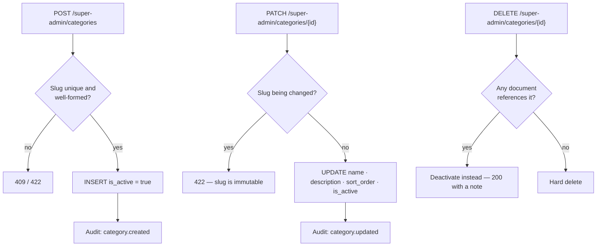

# Feature — Category Management

> **Release 2.** Super Admin only. The `document_categories` table already exists in Release 1
> with 10 seeded rows; what is new is an interface to manage them.

## 1. Requirement

The Super Admin maintains the global document category master: add, edit, reorder and deactivate
categories. The list is shared by every organization.

## 2. Business rules

- Categories are **global**, not per-organization. Every tenant classifies against the same
  taxonomy.
- `slug` is unique and **immutable** after creation — it is what the AI classifier returns and
  what the Qdrant payload stores. Changing it would orphan every existing classification.
- Categories are **deactivated, never deleted**, while documents reference them.
- A deactivated category disappears from the classifier's choices and from filter dropdowns, but
  documents already carrying it keep it.
- `sort_order` controls presentation everywhere.

## 3. User flow

```
/super-admin/categories
   ↓
Add · edit name and description · reorder · deactivate
   ↓
Changes apply to every organization on the next classification
```

## 4. Backend flow



### Why the slug is immutable

The AI classifier is given the live taxonomy and returns a slug. That slug is stored on the
document and copied into the Qdrant payload as `category_slug`. Renaming it would leave documents
and vectors pointing at a category that no longer exists — a silent classification loss with no
error anywhere. The display name is freely editable; the identifier is not.

## 5. Frontend flow

`/super-admin/categories` — a reorderable list with name, slug (read-only after creation),
description, document count across all organizations, and an active toggle. The description is
worth surfacing: it is sent to the classifier, so it is a prompt input, not a label.

## 6. Database impact

None. `document_categories` is unchanged from Release 1:

| Column | Notes |
| ------ | ----- |
| `id` | UUID PK |
| `slug` | Unique, immutable |
| `name` | Display |
| `description` | **Fed to the AI classifier** |
| `sort_order` | Presentation |
| `is_active` | Deactivation |

No `organization_id` — global by decision.

## 7. API contract

```jsonc
// POST /api/v1/super-admin/categories
{ "slug": "vendor-contracts",
  "name": "Vendor Contracts",
  "description": "Supplier agreements, SOWs and renewal terms.",
  "sort_order": 110 }
```

| Method | Endpoint | Purpose |
| ------ | -------- | ------- |
| GET | `/super-admin/categories` | List, including inactive |
| POST | `/super-admin/categories` | Create |
| PATCH | `/super-admin/categories/{id}` | Update name, description, order, active |
| DELETE | `/super-admin/categories/{id}` | Delete if unused, otherwise deactivate |

Organization Admins keep Release 1's read-only `/admin/documents/categories`, which returns
**active** categories for the filter bar.

## 8. Celery impact

The pipeline's classification stage reads active categories at run time, so a new category applies
to the next document processed. Existing documents are not reclassified — that would mean
re-running the AI stages across the corpus, and is not offered.

## 9. Qdrant impact

None directly. `category_slug` is already in `ChunkPayload`. Deactivating a category does not
touch existing points; documents keep the slug they were classified with.

## 10. Redis impact

None.

## 11. Security considerations

- Super Admin only; Organization Admin tokens are 403 on the write routes.
- The category list is global and non-sensitive — it contains no organization content, which is
  why a Super Admin managing it does not breach the privacy guarantee.
- The `description` field reaches the classifier prompt. It is Super-Admin-authored, so it is
  trusted input, but it is length-capped so a pathological description cannot crowd out the
  document text in the prompt window.

## 12. Error handling

| Situation | Code | HTTP |
| --------- | ---- | ---- |
| Duplicate slug | `CATEGORY_SLUG_TAKEN` | 409 |
| Slug change attempted | `CATEGORY_SLUG_IMMUTABLE` | 422 |
| Malformed slug | `VALIDATION_ERROR` | 422 |
| Unknown category | `CATEGORY_NOT_FOUND` | 404 |
| Org Admin token on a write route | `FORBIDDEN` | 403 |

## 13. Edge cases

| Case | Behaviour |
| ---- | --------- |
| Deactivating a category in use | Allowed; existing documents keep it, new ones cannot choose it |
| Deleting an unused category | Hard delete |
| Deleting a used category | Silently converted to deactivation, reported in the response |
| Adding a category | Applies to the next document classified; no backfill |
| All categories deactivated | Classification degrades to uncategorised — the document still indexes |
| Two Super Admins reordering | Last write wins |

## 14. Testing requirements

```
test_slug_is_immutable_after_creation           ← protects existing classifications
test_duplicate_slug_rejected
test_delete_in_use_category_deactivates_instead
test_deactivated_category_absent_from_classifier_choices
test_deactivated_category_still_shown_on_existing_documents
test_org_admin_can_read_but_not_write_categories
test_new_category_applies_to_the_next_classification
```

## 15. Acceptance criteria

- [ ] Super Admin can create, edit, reorder and deactivate categories
- [ ] Slugs are unique and immutable
- [ ] A category in use cannot be hard-deleted
- [ ] Deactivated categories vanish from classification and filters but persist on documents
- [ ] The list stays global across all organizations
- [ ] Organization Admins retain read-only access
