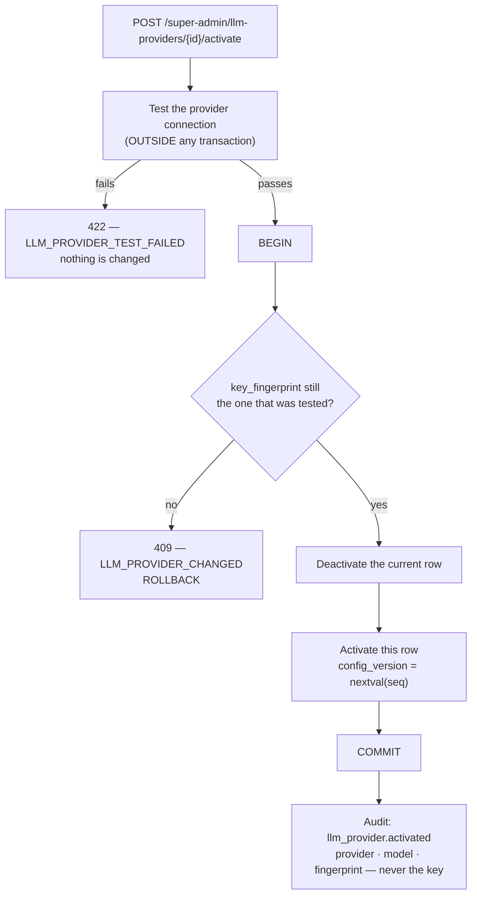
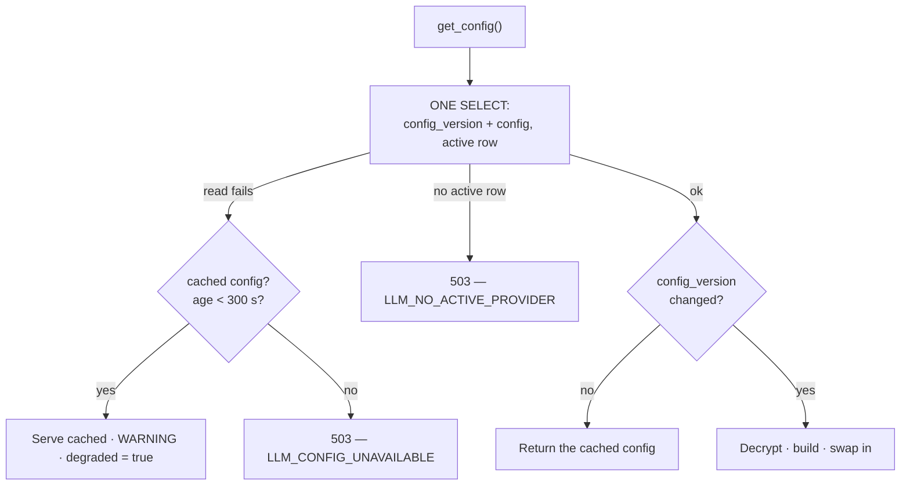

# Feature — LLM Provider Management

> **Release 2.1.** Super Admin only. Moves the answering model out of `.env` and into the
> database, encrypted, switchable without a restart.
> Decisions and their rationale: [ADR-010](../../architecture/decisions/ADR-010-database-backed-llm-credentials.md).

## 1. Requirement

A Super Admin can register several LLM providers, hold their credentials encrypted at rest, and
switch which one answers — without editing a file, without a deploy, and without restarting the
API or the Celery worker.

Today the answer comes from `GEMINI_API_KEY` and `GEMINI_MODEL`, read into `settings` at import.
Changing either means editing a file on the server and restarting **two** long-lived processes,
the key sits in plaintext on disk, and nothing records who changed it or when.

## 2. Business rules

- **Exactly one provider is active** at a time, enforced by a partial unique index rather than by
  application code.
- **The database is the only source of truth.** After the seed migration, `GEMINI_API_KEY` and
  `GEMINI_MODEL` are removed from the settings model; there is no `.env` fallback.
- **Credentials are write-only through the API.** No route returns a key, decrypted or otherwise.
  What comes back is a 16-character fingerprint.
- **A provider must pass a live connection test before it can be activated.** The test runs
  outside the transaction that performs the switch.
- **A switch applies on the next call**, in every process, with no restart and no coordination.
- **The active provider cannot be deleted.** Deactivate by activating a different one.
- **Rollback is manual**: re-activate the previous row. There is no automatic revert.
- Providers are **global**, not per-organization. An Organization Admin cannot see or change them.

## 3. User flow

```
/super-admin/llm-providers
   ↓
Add provider → enter key → Test → saved (inactive)
   ↓
Activate → live connection test → confirm → switch
   ↓
Every organization's next chat message and next document uses it
```

## 4. Backend flow



The read path, run before every LLM call in both the API and the worker:



### Why the version and the config are read together

Both come from the same row in one statement, so they cannot disagree. Split across two reads,
a process can cache *version 6 holding the config as it was at version 5* — a stale config
stamped with the current version, which therefore never rebuilds. See
[ADR-010 §3](../../architecture/decisions/ADR-010-database-backed-llm-credentials.md).

### Why the version comes from a global sequence

Per-row counters collide. Two rows independently reach version 2; a process warm on the inactive
one compares `2 == 2`, does not rebuild, and keeps calling the wrong vendor while the database,
the audit log and the UI all say otherwise. Nothing raises.

## 5. Frontend flow

`/super-admin/llm-providers` — a list of registered providers showing provider, model, key
fingerprint, active state and when it was last changed. Actions: add, edit, test, activate,
delete.

- The key field is **write-only**: it shows the fingerprint of what is stored and accepts a
  replacement, never the current value.
- **Test** is available on every row, independently of activation, so a credential can be checked
  before it is trusted with traffic.
- **Activate** asks for confirmation naming the model, because the change is global and immediate.
- Chat surfaces `degraded` when an answer was produced from a configuration that could not be
  re-confirmed.

Sidebar: a new Super Admin nav entry, alongside Organizations, Categories and Agent Rules.

## 6. Database impact

One new table and one new sequence.

```sql
CREATE SEQUENCE llm_config_version_seq;
```

| Column | Notes |
| ------ | ----- |
| `id` | UUID PK |
| `provider_name` | `gemini` · `openai` · `anthropic` · `azure` |
| `model_name` | **Bare** model id; the `provider/` prefix is composed once, in the factory |
| `encrypted_api_key` | `v1.<key id>.<base64url>` — AES-256-GCM |
| `encryption_key_id` | Which key it was written under; lets a rotation find its work without decrypting |
| `key_fingerprint` | `sha256(plaintext)[:16]`; what the UI, the audit log and the 409 check compare |
| `base_url` | Optional — Azure and self-hosted endpoints |
| `config` | JSONB — temperature, max tokens, timeouts |
| `is_active` | Exactly one true, by index |
| `config_version` | `BIGINT`, from the sequence. Monotonic across **all** rows |
| `created_at` · `updated_at` · `created_by` | Audit trail |

```sql
CREATE UNIQUE INDEX ix_llm_providers_one_active
  ON llm_providers (is_active) WHERE is_active;
```

A **data migration** seeds one active row from `GEMINI_API_KEY` and `GEMINI_MODEL`. Without it an
upgrade is a silent outage: the app starts, no provider is configured, and every chat quietly
falls back to the templated composer — HTTP 200, no error code, nothing in the log.

## 7. API contract

```jsonc
// POST /api/v1/super-admin/llm-providers
{ "provider_name": "openai",
  "model_name": "gpt-4o",          // bare — "openai/gpt-4o" is normalised on write
  "api_key": "sk-...",             // write-only, never returned
  "base_url": null,
  "config": { "temperature": 0.2, "timeout_seconds": 30 } }
```

```jsonc
// GET /api/v1/super-admin/llm-providers  → one item
{ "id": "…", "provider_name": "openai", "model_name": "gpt-4o",
  "key_fingerprint": "9f2a1c04be77d310", "encryption_key_id": 1,
  "is_active": true, "config_version": 12,
  "last_tested_at": "2026-09-02T10:14:00Z" }
```

| Method | Endpoint | Purpose |
| ------ | -------- | ------- |
| GET | `/super-admin/llm-providers` | List. Never includes a key |
| GET | `/super-admin/llm-providers/{id}` | One provider |
| POST | `/super-admin/llm-providers` | Register. Validates the credential first |
| PATCH | `/super-admin/llm-providers/{id}` | Update model, base URL, config, or replace the key |
| POST | `/super-admin/llm-providers/{id}/test` | Live connection test, changes nothing |
| POST | `/super-admin/llm-providers/{id}/activate` | The switch |
| DELETE | `/super-admin/llm-providers/{id}` | Only an inactive row |

`/health` gains the active provider, its fingerprint, and the age of the last confirmed
configuration read, so *"no provider configured"* and *"running provider X"* are both directly
visible rather than inferred.

## 8. Celery impact

The worker is a separate long-lived process, and this is where the design earns its keep. It
calls `get_config()` per task, so an activation reaches it on the next document — no restart, no
broker message, no coordination. This is precisely the gap
[ADR-009](../../architecture/decisions/ADR-009-dynamic-agent-rules.md) flagged as unsolved for
file-based rules.

The 300-second last-known-good window matters most here: by the time the config is read, minutes
of extraction and OCR are already spent, and failing costs a full pipeline retry rather than one
request.

Agent 1 (identity documents) moves onto CrewAI/LiteLLM as part of this feature, so all three
agents resolve their provider the same way. It is the only agent that still calls
`google-generativeai` directly, and leaving it there would mean a switch that applies to two
agents out of three.

## 9. Qdrant impact

**None.** Embeddings are local sentence-transformers
([ADR-003](../../architecture/decisions/ADR-003-local-embeddings.md)), so changing the answering
model does not invalidate a single vector and requires no re-indexing. The blast radius is
generation only — worth stating plainly, because "we changed the model" usually implies a
re-embed and here it does not.

## 10. Redis impact

**None, deliberately.** Redis is a broker and a cache here, never a source of truth, and it runs
without a password in this deployment. Pub/sub invalidation was considered and rejected: it would
make a credential path depend on an unauthenticated cache that fails silently when it is down.
Polling a version integer is cheaper than being wrong.

## 11. Security considerations

- Super Admin only. Organization Admin tokens are 403 on every route.
- Credentials are encrypted with **AES-256-GCM**, not merely "AES-256". Under an unauthenticated
  mode the wrong key decrypts to plausible garbage, and the rule that a malformed credential is
  never sent to a provider would have no failure to detect.
- Keys are a **registry** (`ENCRYPTION_KEYS`), and every ciphertext names the key it was written
  under. The re-encryption job is deferred; the ability to write it is not.
- A decrypted key exists **in memory only**. It is never logged, never returned, never audited,
  and never included in an error message or a `/health` response.
- Every activation is audited with provider, model and fingerprint. A Super Admin can repoint
  every tenant's answering model, and authorization cannot restrict that — so the guarantee is
  that it **cannot be exercised silently**, the same compensating control as
  `agent_rule.updated`.
- The active-provider query **must not be routed to a read replica.** Replica lag would
  reintroduce a stale window on the healthy path, which is the one place this design has none.
- A revoked credential stops working within 300 seconds even if the database is unreachable, and
  immediately while it is reachable.

## 12. Error handling

| Situation | Code | HTTP |
| --------- | ---- | ---- |
| Connection test failed | `LLM_PROVIDER_TEST_FAILED` | 422 |
| Credential changed between test and commit | `LLM_PROVIDER_CHANGED` | 409 |
| Unknown provider row | `LLM_PROVIDER_NOT_FOUND` | 404 |
| Deleting the active row | `LLM_PROVIDER_ACTIVE` | 409 |
| No active provider configured | `LLM_NO_ACTIVE_PROVIDER` | 503 |
| Config unreadable and stale beyond 300 s | `LLM_CONFIG_UNAVAILABLE` | 503 |
| Org Admin token on any route | `FORBIDDEN` | 403 |

Encryption failures — a wrong key, an altered row, a key id no longer configured — are internal.
They are logged with the key id and the row id, and reported as `LLM_CONFIG_UNAVAILABLE`. The
client is never told the state of the key registry.

## 13. Edge cases

| Case | Behaviour |
| ---- | --------- |
| Two Super Admins activate different providers at once | The index rejects one; it gets an error, not a half-applied switch |
| Provider activated mid-chat-request | The in-flight request finishes on the old config; the next one uses the new |
| Database briefly unreachable, config cached < 300 s | Answer is served, `degraded = true`, WARNING logged |
| Database unreachable, config cached > 300 s | 503 — bounded staleness beats an unbounded stale credential |
| Database unreachable, process never read a config | 503 — a cold process has nothing to fall back on |
| Active row deleted directly in SQL | 503 `LLM_NO_ACTIVE_PROVIDER` — visible, not a silent fallback |
| Model id entered as `openai/gpt-4o` | Normalised to the bare id on write; the prefix is added once |
| `ENCRYPTION_KEYS` missing an id some row uses | That row fails to decrypt and says which key it needs; other rows are unaffected |
| Key rotated, old key removed too early | Rows written under it become unreadable — the reason `.env.example` says to keep old keys listed |
| Provider works at test time, fails an hour later | Not detectable at activation; surfaces as a chat error and the existing agent fallbacks |

## 14. Testing requirements

```
test_the_wrong_key_raises_instead_of_returning_garbage      ← done, phase 1
test_a_credential_written_before_a_rotation_still_decrypts_after_it
test_two_active_providers_are_rejected_by_the_database
test_the_version_is_monotonic_across_rows                   ← the silent-collision guard
test_a_second_process_sees_an_activation_without_a_restart
test_a_failing_connection_test_changes_nothing
test_a_credential_edited_between_test_and_commit_is_409
test_no_route_ever_returns_an_api_key
test_an_activation_is_audited_without_the_key
test_config_unavailable_and_cold_fails_closed
test_config_unavailable_within_300s_serves_degraded
test_config_unavailable_beyond_300s_fails_closed
test_the_model_prefix_is_composed_exactly_once_per_provider
test_agent_1_produces_a_result_through_the_new_client       ← not merely "does not raise"
test_org_admin_is_403_on_every_provider_route
```

`test_agent_1_produces_a_result_through_the_new_client` is the one that needs teeth. Agent 1's
failure mode is silent and runs in the worker: a document with no identity type is
indistinguishable from a document that legitimately has none.

## 15. Acceptance criteria

- [ ] A Super Admin can register several providers and switch between them from the UI
- [ ] A switch takes effect in the API **and** the Celery worker with no restart
- [ ] Exactly one provider is active, enforced by the database
- [ ] No API response, log line or audit row ever contains a credential
- [ ] Credentials are AES-256-GCM encrypted and carry the id of the key that wrote them
- [ ] A provider cannot be activated without passing a live connection test
- [ ] A brief database outage degrades rather than fails; a long one fails rather than serves a
      stale credential
- [ ] `/health` reports the active provider and its fingerprint
- [ ] `GEMINI_API_KEY` and `GEMINI_MODEL` are gone from the settings model and `.env.example`
- [ ] All three agents resolve their provider through the same path
