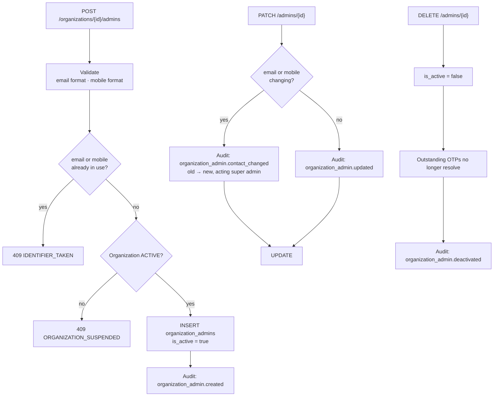

# Feature — Organization Admin Management

> **Release 2.** Super Admin only. Governs the accounts that can reach an organization's data.

## 1. Requirement

The Super Admin creates and deactivates Organization Admins. Each belongs to exactly one
organization and authenticates by OTP — there is no password to set, hold or reset.

## 2. Business rules

- An Organization Admin belongs to **one** organization. Moving between organizations is not
  supported; deactivate and recreate.
- `email` and `mobile` are **globally unique**, because an OTP identifier must resolve to exactly
  one admin.
- No password column exists. This is what makes the Super Admin privacy guarantee structural
  rather than procedural.
- Deactivation is a flag, never a delete — `documents.created_by` points here, and history must
  survive.
- **Changing an existing admin's email or mobile writes a dedicated audit row** recording old and
  new values and the acting Super Admin.
- An organization may have more than one admin. There is no cap.

## 3. User flow

```
/super-admin/organizations/{id}
   ↓
Admins tab  →  Add admin
   ↓
Name, email, mobile
   ↓
Created  →  the admin logs in at /organization/login with an OTP
```

Nothing is sent to the admin in Release 2 — there is no dispatch. The Super Admin tells them out
of band, and on localhost the code is `1111` regardless.

## 4. Backend flow



### The contact-change audit row is not optional

The Super Admin cannot read an organization's data — but they *can* repoint an admin's email at an
address they control and receive that admin's OTP. Access control cannot prevent this, because
managing admins is a legitimate Super Admin power.

What closes the gap is visibility: a distinct, high-signal audit action means the change cannot be
made quietly. The guarantee is therefore **"cannot read silently"**, and the documentation says
exactly that rather than overstating it.

## 5. Frontend flow

An Admins tab inside the organization detail drawer: name, email, mobile, status, last login.
Editing an email or mobile shows an explicit warning that the change will be audited — the warning
is part of the control, not decoration.

## 6. Database impact

New table `organization_admins`:

| Column | Notes |
| ------ | ----- |
| `id` | UUID PK |
| `organization_id` | FK → `organizations.id`, RESTRICT |
| `full_name` | |
| `email` | **globally unique** |
| `mobile` | **globally unique**, nullable |
| `is_active` | Deactivation without deletion |
| `last_login_at` | Set on OTP verification |

`documents.created_by` and `conversations.organization_admin_id` reference this table, replacing
their Release 1 pointers at `users.id`.

## 7. API contract

```jsonc
// POST /api/v1/super-admin/organizations/{id}/admins
{ "full_name": "Priya Sharma",
  "email": "priya@acme.example",
  "mobile": "+919876543210" }

// 201
{ "success": true,
  "data": { "id": "…", "full_name": "Priya Sharma", "email": "priya@acme.example",
            "is_active": true, "last_login_at": null } }
```

| Method | Endpoint | Purpose |
| ------ | -------- | ------- |
| POST | `/super-admin/organizations/{id}/admins` | Create |
| GET | `/super-admin/organizations/{id}/admins` | List for an organization |
| PATCH | `/super-admin/admins/{id}` | Update name, email, mobile |
| DELETE | `/super-admin/admins/{id}` | Deactivate |

No endpoint returns anything an admin has *done* — no document lists, no conversation counts. The
Super Admin manages accounts, not activity.

## 8. Celery impact

None.

## 9. Qdrant impact

None. Admins are not tenants; the organization is.

## 10. Redis impact

Deactivation should revoke that admin's outstanding refresh tokens through the existing Redis
denylist. Without it, a deactivated admin keeps working until their token expires.

## 11. Security considerations

- Every route requires `subject_type = SUPER_ADMIN`.
- **No password is ever set by the Super Admin** — the structural half of the privacy guarantee.
- **Contact changes are audited** — the visibility half.
- Deactivation revokes tokens immediately rather than at expiry.
- Global identifier uniqueness prevents an ambiguous OTP lookup, which would otherwise be a
  cross-tenant login bug.

## 12. Error handling

| Situation | Code | HTTP |
| --------- | ---- | ---- |
| Email or mobile already used | `IDENTIFIER_TAKEN` | 409 |
| Invalid email or mobile format | `VALIDATION_ERROR` | 422 |
| Unknown admin | `ADMIN_NOT_FOUND` | 404 |
| Organization suspended | `ORGANIZATION_SUSPENDED` | 409 |
| Org Admin token | `FORBIDDEN` | 403 |

## 13. Edge cases

| Case | Behaviour |
| ---- | --------- |
| Deactivating the last admin | Allowed; the organization becomes unreachable until one is added |
| Deactivated admin with uploaded documents | Documents remain, attributed to the inactive admin |
| Email reassigned to another admin | Rejected while the first still holds it, active or not |
| Mobile omitted | Allowed; email is then the only identifier |
| Admin deactivated mid-session | Next request fails; refresh token denylisted |
| Reactivation | Out of scope — create a new admin |

## 14. Testing requirements

```
test_duplicate_email_or_mobile_rejected_across_organizations
test_no_password_column_exists                       ← asserts the schema
test_contact_change_writes_a_dedicated_audit_row     ← the guarantee
test_deactivation_revokes_outstanding_tokens
test_deactivated_admin_cannot_verify_an_otp
test_admin_endpoints_never_return_document_or_chat_data
test_org_admin_token_rejected_on_admin_management_routes
```

## 15. Acceptance criteria

- [ ] Super Admin can create, list, update and deactivate Organization Admins
- [ ] Email and mobile are globally unique
- [ ] No password is stored for an Organization Admin
- [ ] Contact changes write a distinct audit action
- [ ] Deactivation revokes tokens immediately
- [ ] These endpoints never expose organization content
