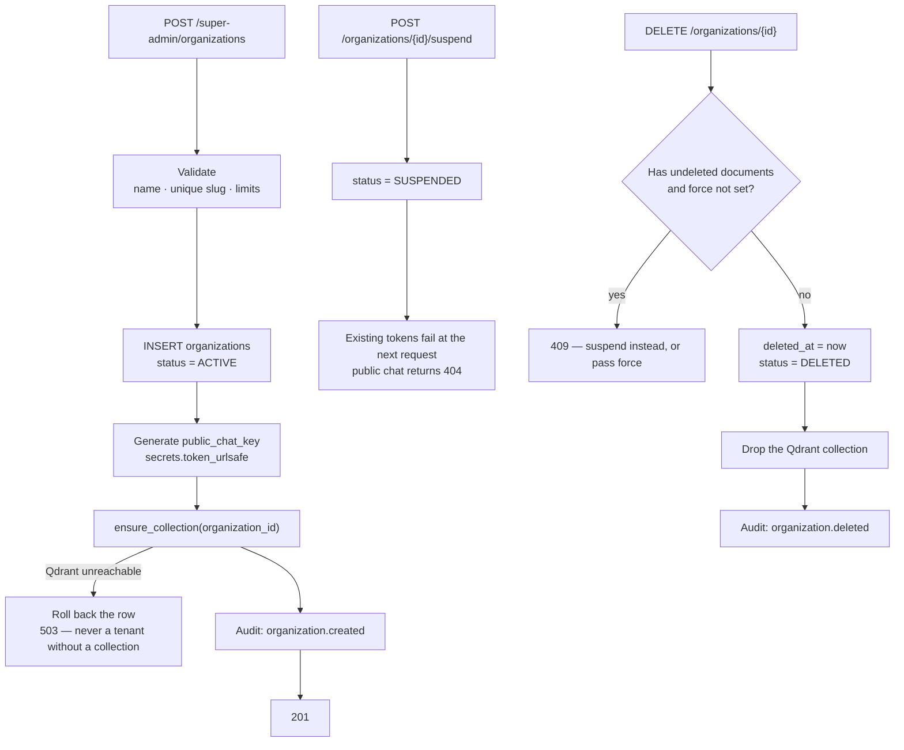

# Feature — Organization Management

> **Release 2.** Super Admin only. No equivalent exists in Release 1.

## 1. Requirement

The Super Admin creates and manages organizations: create, list, view, update, suspend and delete.
Each organization is an isolated tenant with its own documents, chat, vector collection and
administrators.

## 2. Business rules

- The Super Admin belongs to **no** organization and never gains access to one's data by managing
  it.
- `GET /organizations/{id}` returns **counts and metadata only** — never document titles,
  filenames or content. Browsing an organization's document names is already reading its data.
- Creating an organization creates its Qdrant collection.
- **Suspend** is reversible: login and public chat stop, data is retained.
- **Delete** is a soft delete of the row and a **hard delete** of the vector collection.
- `slug` is unique and immutable after creation; it names the collection.
- An organization cannot be deleted while it has undeleted documents unless the caller passes an
  explicit `force` flag — accidental deletion of a tenant is unrecoverable in a way suspension is
  not.

## 3. User flow

```
/login  (Super Admin, password)
   ↓
/super-admin/organizations
   ↓
Create → name, contact email, limits
   ↓
Organization created  →  Qdrant collection provisioned
   ↓
Add an Organization Admin  →  they log in via OTP at /organization/login
```

## 4. Backend flow



### Collection provisioning is part of creation

If Qdrant is unreachable, the organization row is rolled back. An organization that exists in
PostgreSQL but has no collection would accept uploads that then fail at the indexing stage, with
no obvious cause. Better to fail the creation loudly.

## 5. Frontend flow

`/super-admin/organizations` — a table of organizations with status, admin count, document count
and creation date. Row opens a detail drawer, matching the pattern already used for documents in
Release 1. Delete requires typing the organization name, as document deletion does.

## 6. Database impact

New table `organizations`. Full column list in
[../README.md §5](../README.md#5-database-design).

Referenced by `organization_admins`, `documents`, `document_chunks`, `conversations` and
`audit_logs`, all `ON DELETE RESTRICT` — a tenant row cannot vanish while its data exists.

## 7. API contract

```jsonc
// POST /api/v1/super-admin/organizations
{ "name": "Acme Corporation",
  "slug": "acme",
  "contact_email": "ops@acme.example",
  "max_documents": 500,
  "max_document_size_mb": 20,
  "public_chat_enabled": false }

// 201
{ "success": true,
  "data": { "id": "550e8400-…", "name": "Acme Corporation", "slug": "acme",
            "status": "ACTIVE", "public_chat_key": "…",
            "counts": { "admins": 0, "documents": 0 },
            "created_at": "2026-08-29T09:00:00Z" } }
```

```jsonc
// GET /api/v1/super-admin/organizations/{id}
// Counts only. No titles, no filenames, no content.
{ "success": true,
  "data": { "id": "…", "name": "Acme Corporation", "status": "ACTIVE",
            "counts": { "admins": 3, "documents": 128, "public_documents": 12,
                        "conversations": 44 },
            "limits": { "max_documents": 500, "rate_limit_chat": "30/minute" } } }
```

| Method | Endpoint | Purpose |
| ------ | -------- | ------- |
| POST | `/super-admin/organizations` | Create |
| GET | `/super-admin/organizations` | List — search, status filter, pagination |
| GET | `/super-admin/organizations/{id}` | Detail (counts only) |
| PATCH | `/super-admin/organizations/{id}` | Update name, contact, limits, public-chat switch |
| POST | `/super-admin/organizations/{id}/suspend` | Suspend |
| POST | `/super-admin/organizations/{id}/activate` | Reverse a suspension |
| DELETE | `/super-admin/organizations/{id}` | Soft delete + drop collection |

## 8. Celery impact

None. Creation and deletion are synchronous — dropping a collection is fast, and doing it in the
background would leave a window where a deleted organization's vectors are still searchable.

## 9. Qdrant impact

Create: `ensure_collection(organization_id)` — 768-d, cosine, matching Release 1's parameters.
Delete: `delete_collection`. This is the **only** place outside tests where a collection is
dropped, and it supersedes ADR-006's "created once, never recreated" for the multi-tenant case.

## 10. Redis impact

Suspension and deletion clear that organization's rate-limit counters, so a recreated organization
does not inherit a spent budget.

## 11. Security considerations

- Every route requires `subject_type = SUPER_ADMIN`; an Organization Admin token is 403.
- The detail endpoint is **deliberately content-free**. This is the mechanism behind the privacy
  guarantee, not a UI choice.
- `public_chat_key` is generated server-side with `secrets`, never client-supplied.
- Every mutation writes an audit row with the acting Super Admin, the request id and the IP.
- Delete is guarded by an explicit `force` flag when documents exist.

## 12. Error handling

| Situation | Code | HTTP |
| --------- | ---- | ---- |
| Duplicate slug | `ORGANIZATION_SLUG_TAKEN` | 409 |
| Invalid slug format | `VALIDATION_ERROR` | 422 |
| Unknown organization | `ORGANIZATION_NOT_FOUND` | 404 |
| Delete with documents, no force | `ORGANIZATION_NOT_EMPTY` | 409 |
| Qdrant unreachable on create | `VECTOR_STORE_UNAVAILABLE` | 503 |
| Org Admin token | `FORBIDDEN` | 403 |

## 13. Edge cases

| Case | Behaviour |
| ---- | --------- |
| Suspend while an admin is mid-session | Their next request fails; no forced logout |
| Suspend with public chat live | Widget returns 404 immediately |
| Reactivate | Data intact, collection untouched, admins can log in again |
| Delete then recreate with the same slug | Rejected — the soft-deleted row still holds the slug |
| Qdrant unreachable on delete | Row soft-deleted, collection orphaned, error logged, admin alerted |
| Two Super Admins editing one organization | Last write wins; both are audited |

## 14. Testing requirements

```
test_creating_an_organization_provisions_its_collection
test_creation_rolls_back_when_qdrant_is_unreachable
test_detail_never_returns_document_titles_or_content   ← the privacy guarantee
test_duplicate_slug_rejected
test_suspend_blocks_admin_login_and_public_chat
test_activate_restores_access_with_data_intact
test_delete_requires_force_when_documents_exist
test_delete_drops_the_qdrant_collection
test_org_admin_token_rejected_on_all_super_admin_routes
test_every_mutation_writes_an_audit_row
```

## 15. Acceptance criteria

- [ ] Super Admin can create, list, view, update, suspend, activate and delete organizations
- [ ] Creating an organization provisions its Qdrant collection, or fails
- [ ] The detail endpoint exposes counts only — never content
- [ ] Suspension is reversible and retains all data
- [ ] Deletion drops the collection
- [ ] Every mutation is audited
- [ ] Organization Admin tokens cannot reach any of these routes
