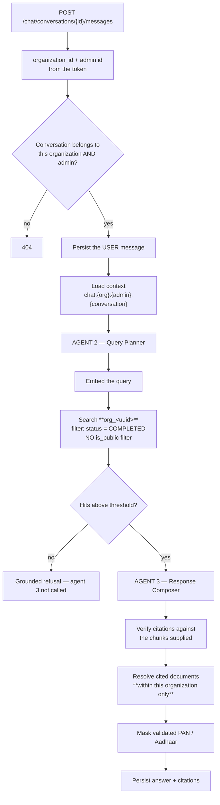

# Feature — Organization-Scoped Chat

> **Release 2.** Modifies Release 1's [rag-chat.md](../../features/rag-chat.md) and
> [conversation-management.md](../../features/conversation-management.md). Every grounding rule
> there still holds.

## 1. Requirement

An Organization Admin chats against **all** of their organization's completed documents, and never
another organization's. Retrieval, citations and conversation history are all confined to the
tenant.

## 2. Business rules

- Retrieval searches the organization's own collection. There is no cross-organization search.
- Unlike the public chatbot, the admin's chat is **not** limited to public documents — an admin
  sees their whole corpus.
- Conversations belong to an organization, not just a person.
- Every Release 1 grounding rule survives unchanged: the composing agent is not called when
  retrieval is empty, citations are verified against what was supplied, and PII is masked before
  the answer is stored.
- Citations resolve only within the organization. A cited document that has been deleted still
  renders, greyed — but a citation can never point outside the tenant, because it never came from
  outside it.

## 3. User flow

Unchanged from Release 1. The sidebar lists that admin's conversations; the answer carries source
chips; a refusal is styled as an answer, not an error.

## 4. Backend flow



The only structural change is `SR`: the collection is chosen from the token's organization instead
of being a fixed constant. Everything downstream is Release 1 code.

## 5. Frontend flow

No change. `ChatPanel`, `ConversationList` and the Markdown renderer are reused as-is.

## 6. Database impact

| Table | Change |
| ----- | ------ |
| `conversations` | **+`organization_id`** NOT NULL; `user_id` → nullable **`organization_admin_id`**; **+`visitor_session_id`** nullable; CHECK — exactly one of the two is set |
| `chat_messages` | Unchanged (reached through `conversations`) |
| `message_sources` | Unchanged; `document_id` stays `ON DELETE RESTRICT` |

The CHECK constraint is worth stating explicitly:

```sql
CHECK (
  (organization_admin_id IS NOT NULL AND visitor_session_id IS NULL)
  OR
  (organization_admin_id IS NULL AND visitor_session_id IS NOT NULL)
)
```

A conversation is owned by an admin or by an anonymous visitor. Never both, never neither. Without
the constraint, a bug could produce a row that no ownership query matches — invisible to its owner
and to any cleanup.

Index: `(organization_id, last_message_at)` for the sidebar.

## 7. API contract

Paths unchanged. Scope changes.

| Method | Endpoint | Change |
| ------ | -------- | ------ |
| POST | `/chat/conversations` | Stamped with the token's organization |
| GET | `/chat/conversations` | Filtered by organization **and** admin |
| GET/PATCH/DELETE | `/chat/conversations/{id}` | 404 on another tenant's id |
| POST | `/chat/conversations/{id}/messages` | Retrieval confined to the organization's collection |

Response shape is identical to Release 1, so the frontend contract is untouched.

## 8. Celery impact

None. Chat is synchronous, as in Release 1.

## 9. Qdrant impact

`search()` takes `organization_id` as a **required, first positional** argument and resolves the
collection from it. The admin path applies no `is_public` filter — that condition belongs only to
the public chatbot.

There is exactly **one** call site into Qdrant search in the whole codebase
(`retrieval_service.py`), which is why this change is small despite being critical.

## 10. Redis impact

Context keys become `chat:{organization_id}:{admin_id}:{conversation_id}`. A cache miss still
rebuilds from PostgreSQL, and the rebuild query is organization-filtered like every other.

## 11. Security considerations

- The collection is selected from the token. A caller cannot name one.
- Cited chunk ids are intersected with what was supplied **and** resolved against documents in the
  caller's organization — two independent checks.
- Conversation ownership is checked by organization and admin; a colleague's conversation in the
  same organization is also 404.
- Redis keys are namespaced by organization, so a key-collision bug cannot serve another tenant's
  context.

## 12. Error handling

Release 1's table applies unchanged. Added:

| Situation | Code | HTTP |
| --------- | ---- | ---- |
| Another organization's conversation | `CONVERSATION_NOT_FOUND` | 404 |
| Another admin's conversation | `CONVERSATION_NOT_FOUND` | 404 |
| Organization's collection missing | Empty retrieval → grounded refusal, logged | 200 |

A missing collection produces a refusal rather than an error. It never falls back to another
collection — the correct behaviour on a broken index is to answer nothing, not to answer from
somewhere else.

## 13. Edge cases

| Case | Behaviour |
| ---- | --------- |
| Organization has no documents | Refusal every time, as with an empty corpus in Release 1 |
| Cited document deleted afterwards | Citation renders greyed; `message_sources` survives via RESTRICT |
| Organization suspended mid-conversation | Next message fails at authentication |
| Two admins in one organization | Separate conversation lists, same corpus |
| Redis flushed mid-conversation | Context rebuilt from PostgreSQL, still tenant-filtered |
| Admin deactivated | Conversations remain; the admin cannot reach them |

## 14. Testing requirements

```
test_retrieval_never_leaves_the_org_collection
test_conversation_from_another_org_returns_404
test_conversation_from_another_admin_returns_404
test_citations_resolve_only_within_the_organization
test_admin_chat_includes_non_public_documents      ← distinguishes it from the visitor bot
test_missing_collection_refuses_rather_than_falling_back
test_context_key_is_namespaced_by_organization
test_release_1_grounding_rules_still_hold          ← refusal, citation verification, masking
```

The last one matters: the point of scoping is that it changes *what* is retrieved, not *how*
grounding works. If a Release 1 grounding test starts failing, the tenant change has altered
semantics it should not have touched.

## 15. Acceptance criteria

- [ ] Retrieval reads only the caller's organization collection
- [ ] Admin chat covers the whole organization corpus, not just public documents
- [ ] Conversations are scoped by organization and admin
- [ ] Cross-tenant and cross-admin conversation ids return 404
- [ ] Citations never resolve outside the organization
- [ ] A missing collection produces a refusal, never a fallback
- [ ] All Release 1 grounding guarantees still hold
