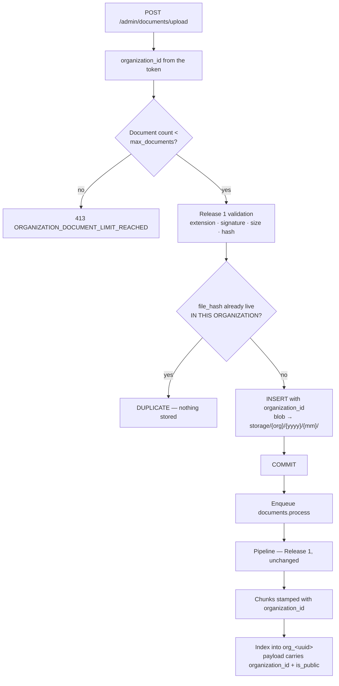

# Feature — Organization-Scoped Documents

> **Release 2.** Modifies the Release 1 upload, processing and management features rather than
> replacing them. Read [../../features/document-upload.md](../../features/document-upload.md),
> [document-processing.md](../../features/document-processing.md) and
> [document-management.md](../../features/document-management.md) first — everything there still
> applies.

## 1. Requirement

Every document belongs to exactly one organization. An Organization Admin sees, uploads, edits and
deletes only their own organization's documents. A document may additionally be marked **public**,
which exposes it to that organization's visitor chatbot and nothing else.

## 2. Business rules

- `documents.organization_id` is NOT NULL. There is no such thing as an unowned document.
- The organization comes from the token, never from the request.
- Upload enforces the organization's `max_documents` cap and `max_document_size_mb`.
- **Duplicate detection is per-organization.** Two organizations uploading the same file get two
  independent documents — telling Organization A that its file already exists in Organization B
  would itself be a cross-tenant disclosure.
- `is_public` defaults to **false**. Publishing is always a deliberate act.
- A document's organization is immutable. There is no move.

## 3. User flow

Identical to Release 1 — the screens do not change. What changes is what they contain: only that
organization's rows, and a publish toggle in the detail drawer.

```
/upload → drop files → per-file results
/documents → search, filter, sort → drawer → edit · publish · download · reprocess · delete
```

## 4. Backend flow



The pipeline itself is untouched. It receives a `document_id`, reads
`document.organization_id`, and writes to that collection. The task never takes an organization
argument, so a malformed message cannot redirect a document into another tenant.

## 5. Frontend flow

No new screens. The document list, filter bar, drawer and upload panel are reused as-is — they
already call the same endpoints, which are now scoped. One addition: a **Public** toggle in the
drawer, with a confirmation, since it changes who can reach the content.

## 6. Database impact

| Table | Change |
| ----- | ------ |
| `documents` | **+`organization_id`** NOT NULL FK, **+`is_public`** Boolean default false; `created_by` retargeted to `organization_admins.id` |
| `document_chunks` | **+`organization_id`** — denormalised so a chunk query cannot forget the join |
| `document_processing` | Unchanged (1:1) |
| `document_tags` | Unchanged (reached through `documents`) |

Indexes: `(organization_id, status, deleted_at)` for the list, `(organization_id, is_public)` for
the public corpus. `organization_id` is the **leading** column in both — a tenant filter that is
not leading still scans other tenants' rows.

Storage keys gain the organization: `storage/{organization_id}/{yyyy}/{mm}/{uuid}.{ext}`. Not a
security boundary — access is checked in the application — but it makes per-tenant backup and
deletion a directory operation.

## 7. API contract

Paths are unchanged from Release 1, which keeps the frontend contract stable. Only scope changes.

```jsonc
// PATCH /api/v1/admin/documents/{id}/publish        ← the one new endpoint
{ "is_public": true }

// 200
{ "success": true,
  "message": "Document published to the public chatbot.",
  "data": { "id": "…", "is_public": true } }
```

| Method | Endpoint | Change |
| ------ | -------- | ------ |
| POST | `/admin/documents/upload` | Organization from token; enforces the cap |
| GET | `/admin/documents` | Filtered by organization in SQL |
| GET/PATCH/DELETE | `/admin/documents/{id}` | Ownership re-checked; **404** on another tenant's id |
| PATCH | `/admin/documents/{id}/publish` | **New** |
| POST | `/admin/documents/{id}/reprocess` | Rewrites into the organization's own collection |
| GET | `/admin/documents/{id}/download` | Ownership re-checked |

## 8. Celery impact

`documents.process` is unchanged in signature and behaviour. It resolves the organization from the
document row and selects the collection from it.

## 9. Qdrant impact

Chunks are indexed into `org_<uuid>`. `ChunkPayload` gains `organization_id` (a cross-check,
redundant given the collection split) and `is_public` (**not** redundant — it is the filter that
separates the visitor corpus from the organization's own).

Publishing a document updates the payload of its existing points. It does **not** re-embed: the
text has not changed, so re-running the encoder would produce identical numbers at a CPU-bound
cost. This is the same reasoning as Release 1's metadata-only edit.

## 10. Redis impact

Upload rate limits become per-organization, using the value on the organization row and falling
back to the global `.env` default.

## 11. Security considerations

- Another organization's document id returns **404**, never 403.
- `organization_id` in a request body is ignored, not validated.
- Publishing is opt-in per document. A document is never public by default, and bulk-publish is
  deliberately not offered.
- Duplicate detection never reveals a match in another organization.
- Deleting an organization's documents removes their vectors from that collection only.

## 12. Error handling

Release 1's per-file upload codes are unchanged. Added:

| Situation | Code | HTTP |
| --------- | ---- | ---- |
| Organization document cap reached | `ORGANIZATION_DOCUMENT_LIMIT_REACHED` | 413 |
| File over the organization's size cap | `FILE_TOO_LARGE` | per-file |
| Another organization's document id | `DOCUMENT_NOT_FOUND` | 404 |
| Publish while not COMPLETED | `DOCUMENT_NOT_PUBLISHABLE` | 409 |

A document that has not finished processing has no vectors, so publishing it would advertise an
empty corpus.

## 13. Edge cases

| Case | Behaviour |
| ---- | --------- |
| Same file uploaded by two organizations | Two independent documents; neither is told about the other |
| Same file uploaded twice in one organization | Duplicate, as in Release 1 |
| Publish then delete | Removed from the public corpus with the rest |
| Unpublish | Payload updated; vectors stay for the organization's own chat |
| Cap reached mid-batch | Files up to the cap are accepted; the rest are rejected per-file |
| Organization suspended mid-upload | The request fails at authentication, before any file is written |
| Reprocess a published document | Stays published; `is_public` survives re-indexing |

## 14. Testing requirements

```
test_upload_stamps_the_token_organization
test_organization_id_in_body_is_ignored
test_list_excludes_other_organizations           ← filtered in SQL, not after
test_fetch_other_org_document_returns_404
test_duplicate_detection_is_per_organization
test_document_cap_enforced_at_upload
test_publish_requires_completed_status
test_publish_updates_payload_without_re_embedding
test_chunks_carry_organization_id
test_reprocess_writes_to_the_owning_collection
```

## 15. Acceptance criteria

- [ ] Every document carries a non-null `organization_id`
- [ ] The list, detail, edit, delete and download paths are all organization-filtered
- [ ] A cross-tenant document id returns 404
- [ ] Duplicate detection never crosses an organization boundary
- [ ] `max_documents` and the size cap are enforced per organization
- [ ] `is_public` defaults to false and requires a deliberate action
- [ ] Publishing does not re-embed
