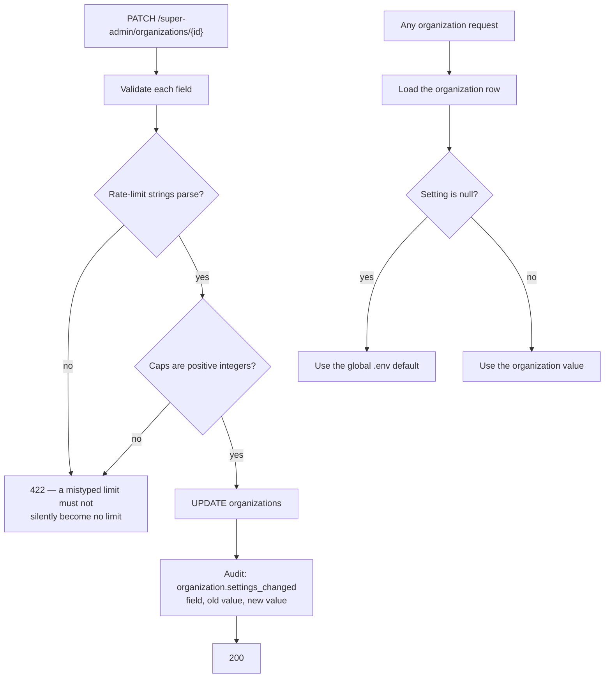

# Feature — Organization Settings

> **Release 2.** Super Admin only. Turns Release 1's global `.env` limits into per-tenant values.

## 1. Requirement

The Super Admin selects an organization and configures its limits: document count cap, maximum
document size, chat and upload rate limits, public chat rate limit, and whether the public chatbot
is enabled.

## 2. Business rules

- Every setting has a **global default** from `.env`. A null organization value means "use the
  default" — it does not mean "unlimited".
- Rate limits reuse the Release 1 limiter and its `"<count>/<window>"` format. A malformed value
  is rejected at save time, not discovered at request time.
- Lowering `max_documents` below the current count is allowed. Existing documents are kept;
  further uploads are refused until the count falls below the cap.
- Changes take effect on the next request. There is no cached copy that needs invalidating beyond
  the settings row itself.
- The Super Admin sets limits without ever seeing content — settings are counts and numbers.

## 3. User flow

```
/super-admin/organizations
   ↓
Select an organization  →  Settings
   ↓
Document cap · size cap · rate limits · public chat toggle
   ↓
Save  →  audited  →  effective immediately
```

## 4. Backend flow



### Validation at save, not at use

Release 1's `parse_rule()` already rejects a bare count like `"5"` rather than reading it as
`5/minute`, because silently reinterpreting configuration is how a limit becomes no limit. The
same parser validates these values on save. A bad value is a 422 the Super Admin sees, not a
runtime failure an organization discovers.

## 5. Frontend flow

`/super-admin/organizations/{id}/settings` — a form with the global default shown beside each
field as placeholder text, so it is obvious which values are overridden and which are inherited.

## 6. Database impact

Columns on `organizations`:

| Column | Default source | Notes |
| ------ | -------------- | ----- |
| `max_documents` | `.env` | Upload cap |
| `max_document_size_mb` | `MAX_DOCUMENT_SIZE_MB` | Per-file |
| `rate_limit_chat` | `RATE_LIMIT_CHAT` | Admin chat |
| `rate_limit_upload` | `RATE_LIMIT_UPLOAD` | Upload |
| `rate_limit_public_chat` | New default | Visitor chatbot |
| `public_chat_enabled` | `false` | Master switch |

Recommended: `organization_settings_audit` — who changed which field, when, from what to what.
Without it, "the Super Admin cannot read your data" has no counter-evidence trail.

## 7. API contract

```jsonc
// PATCH /api/v1/super-admin/organizations/{id}
{ "max_documents": 1000,
  "rate_limit_chat": "60/minute",
  "public_chat_enabled": true }

// 200
{ "success": true,
  "data": { "id": "…",
            "limits": { "max_documents": 1000,
                        "max_document_size_mb": null,   // inherits the global default
                        "rate_limit_chat": "60/minute",
                        "rate_limit_public_chat": null },
            "public_chat_enabled": true } }
```

`null` in the response means inherited, and the frontend renders the effective default beside it.

## 8. Celery impact

None. The processing pipeline reads no organization settings — size caps are enforced at upload,
before a task is enqueued.

## 9. Qdrant impact

None.

## 10. Redis impact

Rate-limit keys are already per-organization. Changing a limit changes the ceiling checked against
the existing counter; it does not reset it. Lowering a limit mid-window can therefore refuse
requests immediately — correct, and worth knowing.

## 11. Security considerations

- Super Admin only; an Organization Admin token is 403.
- Settings expose **counts and numbers only** — no document titles, no chat content. This is the
  same content-free principle as the organization detail endpoint.
- Every change is audited with old and new values.
- Enabling `public_chat_enabled` makes an organization's published documents reachable without
  authentication. The UI states that plainly at the point of the toggle, rather than treating it
  as an ordinary setting.

## 12. Error handling

| Situation | Code | HTTP |
| --------- | ---- | ---- |
| Malformed rate-limit string | `VALIDATION_ERROR` | 422 |
| Negative or zero cap | `VALIDATION_ERROR` | 422 |
| Unknown organization | `ORGANIZATION_NOT_FOUND` | 404 |
| Org Admin token | `FORBIDDEN` | 403 |

## 13. Edge cases

| Case | Behaviour |
| ---- | --------- |
| Cap lowered below the current count | Existing documents kept; uploads refused until under the cap |
| Rate limit lowered mid-window | May refuse immediately; the counter is not reset |
| Setting cleared to null | Reverts to the global default |
| Public chat disabled with a live widget | Widget 404s on the next request |
| Global `.env` default changed | Applies to every organization that has not overridden it |
| Organization suspended | Settings remain editable — they apply again on reactivation |

## 14. Testing requirements

```
test_null_setting_falls_back_to_the_global_default
test_malformed_rate_limit_rejected_at_save         ← not at request time
test_document_cap_enforced_at_upload
test_lowering_cap_below_current_count_is_allowed
test_disabling_public_chat_404s_the_widget
test_settings_change_writes_an_audit_row_with_old_and_new
test_settings_response_contains_no_document_or_chat_data
test_org_admin_cannot_read_or_write_settings
```

## 15. Acceptance criteria

- [ ] Super Admin can set caps and rate limits per organization
- [ ] A null value inherits the global default
- [ ] Malformed rate limits are rejected at save time
- [ ] Caps are enforced at upload
- [ ] The public chat toggle takes effect immediately
- [ ] Every change is audited with old and new values
- [ ] Settings never expose organization content
