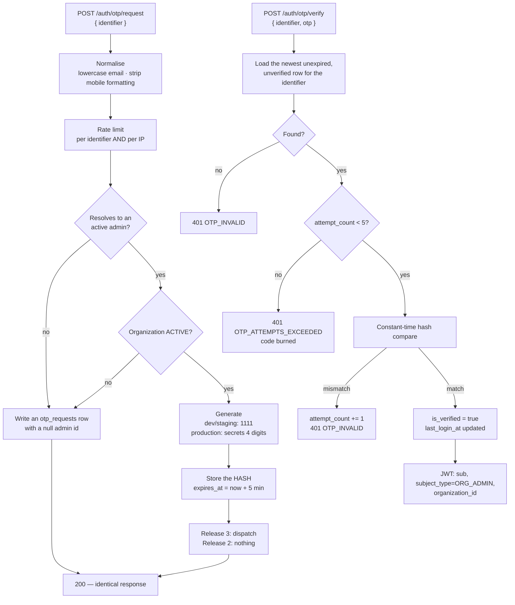

# Feature — OTP Authentication

> **Release 2.** Organization Admins only. Super Admin password login is unchanged from Release 1.

## 1. Requirement

An Organization Admin logs in by entering their email **or** mobile number, receiving a 4-digit
OTP, and verifying it. They have no password — the `organization_admins` table has no password
column.

The OTP is hardcoded to `1111` in `development` and `staging`, and randomly generated in
`production`. "UAT" maps onto the existing `staging` value; no new environment is introduced.

## 2. Business rules

- Identifier is an email or a mobile number; both are **globally unique**, so one identifier
  resolves to exactly one admin.
- The OTP expires after 5 minutes, is single-use, and is burned after 5 failed attempts.
- OTPs are stored **hashed**. A database read must not yield a working code.
- An unknown identifier produces an identical response, with identical timing, to a known one.
- **Release 2 performs no dispatch.** The OTP is recorded in the database only; SMS and email
  arrive in Release 3.
- The application must **refuse to start** if a static OTP is enabled while
  `ENVIRONMENT=production`.

## 3. User flow

```
/organization/login
   ↓
Enter email or mobile  →  "If that identifier exists, a code has been sent."
   ↓
Enter the 4-digit code
   ↓
Verified  →  JWT issued  →  /dashboard
```

The success message is deliberately conditional — it is identical whether or not the identifier
exists.

## 4. Backend flow



### Why a failed lookup still writes a row

If a request for an unknown identifier short-circuited, the response would return measurably
faster than one for a real admin. Writing the row keeps the work — and therefore the timing —
comparable, and leaves a record of the probe.

## 5. Frontend flow

`/organization/login` is a two-step form: identifier, then code. The second step shows a countdown
to expiry and a resend control that is itself rate limited. On `development` and `staging` the page
shows a visible development notice stating the code is `1111` — an admin should never be guessing
at a value the environment has fixed.

## 6. Database impact

New table `otp_requests`: `identifier`, `identifier_type`, `organization_admin_id` (nullable),
`otp_hash`, `expires_at`, `is_verified`, `attempt_count`, `created_at`, `ip_address`.

Indexed on `(identifier, created_at)` for lookup and rate limiting.

`organization_admins.last_login_at` is updated on success.

## 7. API contract

```jsonc
// POST /api/v1/auth/otp/request
{ "identifier": "admin@acme.example" }

// 200 — identical whether or not the identifier exists
{ "success": true,
  "message": "If that identifier exists, a code has been sent.",
  "data": { "expires_in_seconds": 300 } }
```

```jsonc
// POST /api/v1/auth/otp/verify
{ "identifier": "admin@acme.example", "otp": "1111" }

// 200
{ "success": true,
  "data": { "access_token": "…", "token_type": "bearer",
            "organization": { "id": "…", "name": "Acme" } } }
```

The refresh token is issued as an httpOnly cookie exactly as in Release 1.

## 8. Celery impact

None in Release 2. Release 3 may dispatch asynchronously — but a queued OTP that arrives after its
own 5-minute expiry is useless, so dispatch should stay synchronous unless the queue is provably
fast.

## 9. Qdrant impact

None.

## 10. Redis impact

Rate-limit counters for `otp:request:{identifier}` and `otp:request:ip:{ip}`, reusing the existing
fixed-window limiter. The OTP itself lives in PostgreSQL, not Redis — an audit trail of login
attempts should survive a cache restart.

## 11. Security considerations

| Control | Value | Why |
| ------- | ----- | --- |
| Expiry | 5 minutes | Bounded window |
| Max attempts | 5, then burned | **4 digits is 10,000 combinations. Without this it is not authentication** |
| Single use | Invalidated on success | No replay |
| Storage | Hashed | A database read yields nothing usable |
| Request rate limit | Per identifier and per IP | Prevents inbox flooding and mass enumeration |
| Unknown identifier | Identical response and timing | No account enumeration |
| Comparison | Constant time | No timing oracle |
| Static OTP | Impossible in production | Startup guard, not a runtime branch |

> 🔴 **Release 2 OTP login is not an authentication boundary.** With `1111` fixed and no dispatch,
> anyone who knows an admin's email address can log in. This is acceptable only because the
> deployment is localhost-only. It must not reach any shared environment before Release 3.

## 12. Error handling

| Situation | Code | HTTP |
| --------- | ---- | ---- |
| Empty or malformed identifier | `VALIDATION_ERROR` | 422 |
| Too many requests for an identifier | `RATE_LIMIT_EXCEEDED` | 429 |
| Wrong code | `OTP_INVALID` | 401 |
| Expired code | `OTP_EXPIRED` | 401 |
| Five failed attempts | `OTP_ATTEMPTS_EXCEEDED` | 401 |
| Already-verified code | `OTP_INVALID` | 401 |
| Admin deactivated | `OTP_INVALID` | 401 |
| Organization suspended | `ORGANIZATION_SUSPENDED` | 403 |

A deactivated admin gets `OTP_INVALID` rather than a specific code — the login surface should not
reveal account state. A suspended *organization* is distinguishable, because its admin needs to
know why they cannot work.

## 13. Edge cases

| Case | Behaviour |
| ---- | --------- |
| Two codes requested in quick succession | The newest wins; earlier unverified rows are ignored |
| Code verified twice | Second attempt fails — single use |
| Identifier changed by the Super Admin mid-flight | Outstanding codes no longer resolve |
| Same person is admin of two organizations | Not possible — identifiers are globally unique |
| Clock skew | `expires_at` is server-side; the client countdown is cosmetic |
| Mobile entered with formatting | Normalised before lookup |

## 14. Testing requirements

```
test_expired_otp_rejected
test_otp_burns_after_five_attempts
test_otp_is_single_use
test_unknown_identifier_response_is_identical      ← body, status and timing
test_otp_is_stored_hashed_never_plaintext
test_static_otp_refused_when_environment_is_production   ← the startup guard
test_suspended_organization_admin_cannot_verify
test_deactivated_admin_gets_generic_invalid
test_rate_limit_applies_per_identifier_and_per_ip
```

## 15. Acceptance criteria

- [ ] An Organization Admin can log in with email or mobile and a 4-digit code
- [ ] The code expires, is single-use, and burns after 5 attempts
- [ ] OTPs are stored hashed
- [ ] An unknown identifier is indistinguishable from a known one
- [ ] `1111` applies only to `development` and `staging`
- [ ] The application refuses to start with a static OTP in production
- [ ] No password column exists on `organization_admins`
