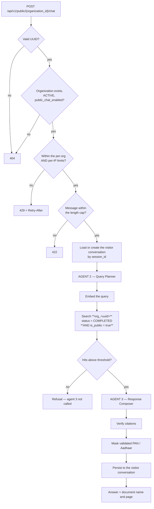

# Feature — Public Chatbot

> **Release 2.** The only unauthenticated feature in the system.

## 1. Requirement

An organization can expose a chatbot to the public: as a hosted page at
`/{organization_id}/chat`, and as a widget embedded on a third-party site with a `<script>` tag.
It answers only from documents the organization has explicitly published.

## 2. Business rules

- The organization must be **ACTIVE** and have `public_chat_enabled = true`. Otherwise: 404.
- The corpus is **`is_public = true` only**. A private document is never retrieved, never cited,
  never quoted.
- No authentication. Identification is the organization id in the URL, which is public by design.
- Rate limited on two axes: per organization (the tenant's own budget, Super Admin configurable)
  and per IP (one abusive visitor).
- Visitor conversations are anonymous: no account, a client-generated `session_id`.
- Public responses expose `document_name` and `page` — **never** `document_id` or `chunk_id`.
- All Release 1 grounding rules apply, including refusal when nothing clears the threshold.

## 3. User flow

```
Third-party page with <script src="…/widget.js" data-organization-id="…">
        ↓
Launcher button appears, bottom-right
        ↓
Click → iframe opens → /{organization_id}/chat?embed=1
        ↓
Ask a question
        ↓
Grounded answer + source chips (document name and page), or a refusal
```

The hosted page works standalone at the same URL without `?embed=1`, for organizations that want
to link to it rather than embed it.

## 4. Backend flow



### The two conditions that belong together

The public path is the **only** place an organization id comes from a URL, and the **only** place
carrying the `is_public` filter. That is not a coincidence: the untrusted input and the narrowed
corpus are the same decision. Anywhere the id is untrusted, the corpus must be the published one.

## 5. Frontend flow

**Hosted page** — `/{organization_id}/chat`. A trimmed `ChatPanel`: no sidebar, no shell, no
navigation. `?embed=1` removes remaining page chrome for iframe use.

**Widget** — `widget.js`, served by Next.js:

```html
<script src="http://localhost:3000/widget.js"
        data-organization-id="550e8400-e29b-41d4-a716-446655440000"
        defer></script>
```

It injects a launcher button and, on click, an iframe pointing at the hosted page.

### Why an iframe rather than injected DOM

The host page cannot read the conversation, our CSS cannot break their layout, and their CSS
cannot break ours. For a chat that surfaces an organization's published material onto an arbitrary
third-party site, that isolation is the entire point.

### Reusing the Stitch reference

`stitch_documind_ai_interface/ai_rag_chat/code.html` was reviewed: 411 lines, Tailwind via CDN,
three inert `<script>` tags, no state and no backend calls — a static export.

**Assessment: reuse the visual design, not the file.** The layout, chips and message bubbles are
worth keeping. The markup has no data flow to adapt, and a CDN Tailwind dependency is unsuitable
for anything embedded. The existing React `ChatPanel` already implements the behaviour and renders
Markdown; the public page should be a trimmed version of that component, not a port of the HTML.

`tidio-live-chat.png` in the same folder is the reference for the launcher pattern.

## 6. Database impact

No new tables. `conversations` gains `visitor_session_id` (nullable) and `organization_id`, with
the CHECK constraint described in
[organization-scoped-chat.md §6](organization-scoped-chat.md#6-database-impact).

`organizations` supplies `public_chat_enabled`, `public_chat_key` and `rate_limit_public_chat`.

## 7. API contract

```jsonc
// GET /api/v1/public/{organization_id}/config
{ "success": true,
  "data": { "organization_name": "Acme Corporation",
            "greeting": "Hi — ask me about our published policies.",
            "theme": { "primary": "#15157d" } } }
```

```jsonc
// POST /api/v1/public/{organization_id}/chat
{ "message": "What are your opening hours?",
  "session_id": "b6c1…" }

// 200 — a refusal is also a 200
{ "success": true,
  "data": { "answer": "Weekdays, 9am to 6pm.",
            "is_grounded": true,
            "sources": [{ "document_name": "Opening Hours.pdf", "page": 1 }],
            "session_id": "b6c1…" } }
```

No `document_id`, no `chunk_id`, no `conversation_id`. Internal identifiers are useless to a
visitor and give an attacker a map.

## 8. Celery impact

None.

## 9. Qdrant impact

Searches `org_<uuid>` with `status = COMPLETED` **AND** `is_public = true`. The second condition
is the only difference from the admin chat path, and it is not optional — it is added by the
public service, not passed in by the caller.

## 10. Redis impact

- Rate-limit counters: `ratelimit:public_chat:{organization_id}` and
  `ratelimit:public_chat_ip:{ip}`
- Visitor context: `chat:{organization_id}:visitor:{session_id}`, same 24-hour TTL

## 11. Security considerations

| Concern | Control |
| ------- | ------- |
| Reaching private documents | `is_public = true` enforced server-side in the query |
| Reaching another organization | Collection selected from the URL id; wrong id = wrong collection, and only its public documents |
| Unlimited questions | Per-organization limit, Super Admin configurable |
| One abusive visitor | Per-IP limit, applied in addition |
| Cost amplification | Message length cap; the organization limit bounds worst-case spend |
| Prompt injection from a document | Release 1 composer rules; the corpus is admin-published, which is the real mitigation |
| Enumerating the corpus | Answers are grounded and cited; the source file is never downloadable |
| Internal id disclosure | Public responses carry names and pages only |
| Disabled or suspended organization | 404 — indistinguishable from a nonexistent one |
| CORS | The public endpoints are the only ones that may accept a third-party origin |

> **CORS on localhost is permissive by necessity.** A production deployment must restrict the
> widget to an origin allow-list per organization. That is deferred with the rest of production
> hardening — see [../README.md §13](../README.md#13-what-release-2-is-not).

## 12. Error handling

| Situation | Response |
| --------- | -------- |
| Malformed organization id | 404 |
| Unknown, suspended, or chat-disabled organization | 404 — all identical |
| Over the rate limit | 429 with `Retry-After` |
| Message too long | 422 |
| Nothing retrieved | **200** with a grounded refusal |
| Qdrant unreachable | 503, with a friendly widget message |
| Agent failure | Silent fallback, exactly as in Release 1 |

Unknown, suspended and disabled all return the same 404 deliberately: distinguishing them would
confirm which organization ids exist.

## 13. Edge cases

| Case | Behaviour |
| ---- | --------- |
| No published documents | Refusal every time — correct, not an error |
| Document unpublished mid-session | Next query no longer retrieves it; earlier citations remain in the transcript |
| Widget embedded on many sites | Works; all traffic counts against the same organization budget |
| Snippet copied to an unauthorised site | Works on localhost. Origin allow-listing is the production answer |
| Visitor clears storage | New `session_id`, new conversation, no history |
| Organization deleted while a widget is live | 404 |
| Two visitors share an IP | Both count against the same per-IP budget — accepted |

## 14. Testing requirements

```
test_public_chat_returns_only_public_documents      ← the central case
test_private_document_never_cited_or_quoted
test_public_chat_on_suspended_org_returns_404
test_public_chat_when_disabled_returns_404
test_unknown_org_and_disabled_org_are_indistinguishable
test_response_never_contains_document_or_chunk_ids
test_rate_limit_per_organization_and_per_ip
test_message_length_cap_enforced
test_visitor_conversation_has_no_admin_id           ← the CHECK constraint
test_refusal_when_no_public_documents
```

## 15. Acceptance criteria

- [ ] A `<script>` tag on any HTML page renders a working chat widget
- [ ] The hosted page works standalone at `/{organization_id}/chat`
- [ ] Only `is_public` documents are ever retrieved
- [ ] Suspended, disabled and unknown organizations are indistinguishable 404s
- [ ] Rate limiting applies per organization and per IP
- [ ] Responses carry document names and pages, never internal ids
- [ ] Visitor conversations are anonymous and persisted against the organization
- [ ] Release 1 grounding and PII masking still apply
