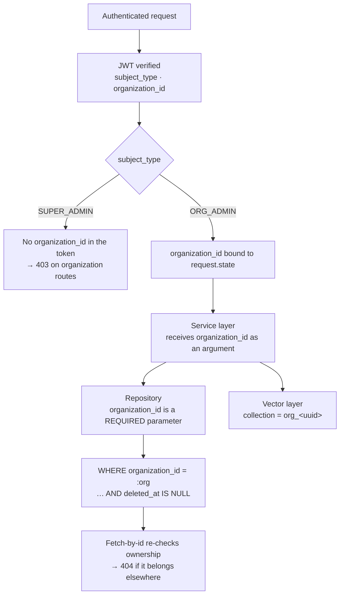

# Feature — Tenant Isolation

> **Release 2.** Cross-cutting. Every other Release 2 feature depends on this one being correct.

## 1. Requirement

An Organization Admin must never retrieve a document, chunk, vector, conversation, message or
citation belonging to another organization. Enforced in the data-access layer, never in the UI.

Release 1 has no tenancy at all — `grep -rn "organization" backend/app/` returns nothing — so this
is new behaviour throughout, not a tightening of something existing.

## 2. Business rules

- The organization is derived **once**, from the authenticated subject, and passed down.
- No service or repository accepts an organization id from a request body, query string or path on
  an authenticated route.
- The **only** exception is the public chat endpoint, where the id comes from the URL and the
  corpus is narrowed to `is_public = true` in exchange.
- A request for another organization's resource returns **404, not 403**. A 403 confirms the id
  exists.
- A Super Admin token carries no `organization_id`, so organization routes reject it structurally
  rather than by a permission check.
- Isolation holds at four layers; no single layer failing may be sufficient to leak.

## 3. User flow

Invisible when it works. Visible only as an absence — Organization B's documents never appear in
Organization A's list, search, chat or citations.

## 4. Backend flow



### The four layers

| # | Layer | Mechanism | Failure mode if omitted |
| - | ----- | --------- | ----------------------- |
| 1 | Token | `organization_id` is a signed claim | Caller could name any organization |
| 2 | Repository | Required, non-defaulted parameter on every query | **Silent cross-tenant read** |
| 3 | Vector store | Separate Qdrant collection per organization | Wrong collection returns nothing, not other data |
| 4 | Response | Ownership re-checked on fetch-by-id | Direct id access leaks a single record |

### Why the parameter must not have a default

```python
# WRONG — fails open. One forgotten call site leaks silently, in production, with no error.
def list_documents(self, query: ListQuery, organization_id: UUID | None = None): ...

# RIGHT — fails closed. Omitting it is a TypeError at import time.
def list_documents(self, organization_id: UUID, query: ListQuery): ...
```

This is the single most important line of design in Release 2. An optional tenant filter is
indistinguishable from a correct one in review, and distinguishable from it only by a data breach.

## 5. Frontend flow

The frontend never sends an organization id on an authenticated request. It does not know one, and
would be ignored if it did. Route handlers reject a mismatched subject type early as a convenience;
the backend re-checks regardless.

## 6. Database impact

`organization_id` NOT NULL on `documents`, `document_chunks`, `conversations`; nullable on
`audit_logs`. Every existing composite index gains it as the **leading** column — a tenant filter
that is not leading still scans other tenants' rows before discarding them.

`document_chunks.organization_id` is denormalised deliberately: it is derivable by joining
`documents`, but the failure mode of forgetting that join is a silent leak, and the cost is one
UUID per row.

## 7. API contract

No endpoint accepts `organization_id` as an input on an authenticated route. Any such field in a
request body is ignored rather than validated — validating it would imply it could be honoured.

## 8. Celery impact

The processing task receives only a `document_id`. It loads the document, reads
`document.organization_id`, and writes to that organization's collection. The task never takes an
organization argument, so a malformed message cannot redirect a document into another tenant.

## 9. Qdrant impact

One collection per organization, named `org_` + the UUID with hyphens removed. Isolation becomes
structural: retrieving another tenant's vectors requires naming their collection, not forgetting a
filter. See [../../release-2/README.md §8](../README.md#8-vector-database-design).

## 10. Redis impact

Chat context keys become `chat:{organization_id}:{subject_id}:{conversation_id}`. Rate-limit keys
gain the organization so one tenant cannot exhaust another's budget.

## 11. Security considerations

- **404 over 403** on another tenant's id, always.
- **Suspended organizations** are rejected at authentication, not at each route.
- **Audit rows** carry `organization_id`, so a cross-tenant read attempt is reviewable after the
  fact even though it was blocked.
- The organization id is **public knowledge** by design — it appears in the public chat URL.
  Isolation therefore rests on enforcement, never on the id being secret.

## 12. Error handling

| Situation | Response |
| --------- | -------- |
| Another organization's document id | `404 DOCUMENT_NOT_FOUND` |
| `organization_id` supplied in a body | Silently ignored; token wins |
| Super Admin token on an organization route | `403 FORBIDDEN` |
| Org Admin token on a Super Admin route | `403 FORBIDDEN` |
| Suspended organization | `403 ORGANIZATION_SUSPENDED` at login |
| Qdrant collection missing | Empty result, logged — never a fallback to another collection |

## 13. Edge cases

| Case | Behaviour |
| ---- | --------- |
| Organization deleted while an admin is mid-session | Next request fails on the suspended/deleted check |
| Document cited in a chat, then the organization is deleted | Collection dropped; the message row survives with its citation |
| Two organizations upload the identical file | Independent documents — duplicate detection is per-organization |
| Admin moved between organizations | Not supported; deactivate and recreate |
| Qdrant collection deleted out of band | Search returns nothing; it is never recreated silently with another tenant's data |

## 14. Testing requirements

The isolation suite is the evidence the requirement holds. Without it there is no basis for
claiming isolation at all.

```
test_org_a_admin_cannot_read_org_b_document          → 404
test_org_id_in_body_is_ignored_token_wins            → Org A data only
test_chat_retrieval_never_leaves_the_org_collection  → org_A only
test_document_list_excludes_other_orgs               → filtered in SQL, not after
test_super_admin_token_rejected_on_document_routes   → 403
test_suspended_org_admin_cannot_log_in               → 403
test_deleting_an_org_drops_its_collection            → collection gone
test_every_repository_method_requires_organization_id → introspection over the repository classes
```

That last one is worth writing even though it is unusual: it inspects each repository's method
signatures and asserts `organization_id` is present and has no default. It catches the next method
someone adds, not just the ones that exist today.

## 15. Acceptance criteria

- [ ] Every repository method reading a tenant-owned table requires `organization_id`
- [ ] No authenticated route reads an organization id from the request
- [ ] Each organization has its own Qdrant collection
- [ ] Cross-tenant fetch-by-id returns 404
- [ ] Super Admin tokens cannot reach organization data routes
- [ ] The isolation suite passes and is part of the default test run
